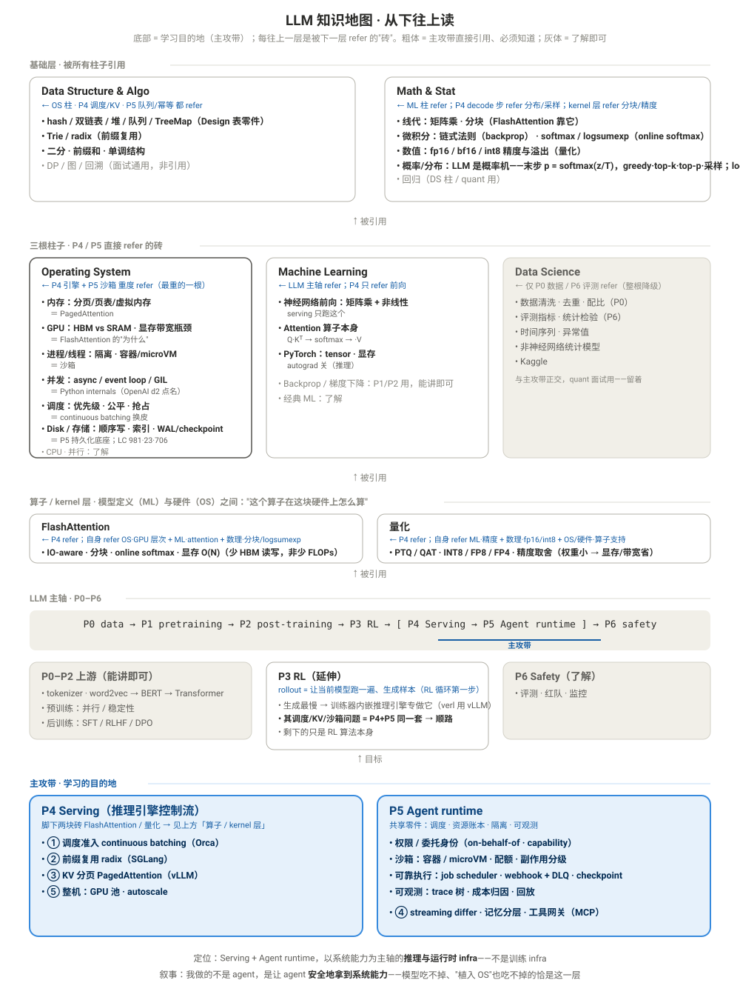

# cs-resources

LLM 知识地图，**从下往上读**：底部是学习的目的地（主攻带 P4 Serving / P5 Agent runtime），每往上一层是被下一层引用的"砖"，一直追到算法与数理基础。每块砖旁的「←」标明是谁 refer 了它——任何一条你追一下箭头就知道它为什么在图上。

**加粗** = 主攻带直接引用、必须知道长什么样；普通字重 = 了解 / 能讲即可。

> 📑 **Sibling 文件**：
> - [`cs-bookmarks.md`](cs-bookmarks.md) — 全部资源明细（AI 截图 + 书签按 P0–P6 分节，含 Pipeline 总表 + CS 通用书签）
> - [`lc-coverage-framework.md`](lc-coverage-framework.md) — LeetCode 双框架 + Design 表（零件 / 真题，标 P4/P5）+ 练习学习清单 + 刷题笔记
> - [`quant-coverage-framework.md`](quant-coverage-framework.md) — 量化面试知识框架
> - [`math-section-reading-template.md`](math-section-reading-template.md) · [`shreve-ii-1.1-measure-theory.md`](shreve-ii-1.1-measure-theory.md) · [`esl-ch2-ontology.md`](esl-ch2-ontology.md) — 数学 / 统计精读



<details>
<summary>文字版（可搜索 / 可复制）</summary>

## 基础层 · 被所有柱子引用

**Data Structure & Algo** ← OS 柱 · P4 调度/KV · P5 队列/幂等 都 refer
- **hash / 双链表 / 堆 / 队列 / TreeMap**（Design 表零件）
- **Trie / radix**（前缀复用）
- **二分 · 前缀和 · 单调结构**
- DP / 图 / 回溯（面试通用，非引用）

**Math & Stat** ← ML 柱 refer；P4 里 FlashAttention / 量化 refer
- **线代：矩阵乘 · 分块**（FlashAttention 靠它）
- **微积分：链式法则**（backprop）
- **softmax / logsumexp**（online softmax）
- **数值：fp16 / bf16 / int8 精度与溢出**（量化）
- **概率 / 分布：LLM 是概率机——最后一步 `p = softmax(z / T)`，然后 greedy · top-k · top-p · 采样；logprobs · perplexity**（P4 decode 步 refer；面试必问"最后一步公式长啥样"）
- 回归（DS 柱 / quant 用）

<div align="center">↑ 被引用</div>

## 三根柱子 · P4 / P5 直接 refer 的砖

**Operating System** ← P4 引擎 + P5 沙箱 重度 refer（主攻带最重的一根柱子）
- **内存：分页 / 页表 / 虚拟内存**（PagedAttention 就是它）
- **GPU：HBM vs SRAM 层次 · kernel · 显存带宽瓶颈**（FlashAttention 的"为什么"）
- **进程 / 线程：隔离 · 容器 / microVM**（沙箱）
- **并发：async / event loop / GIL**（Python internals，OpenAI d2 点名）
- **调度：优先级 · 公平 · 抢占**（continuous batching 就是 CPU 调度换皮）
- **Disk / 存储：顺序写 + 索引 · WAL / checkpoint · LSM**（P5 可靠执行的持久化底座——"重启不丢"；LC 呼应：**981** 版本二分 · **23** k 路归并 / LSM compaction · **706** 幂等键 = 去重表）
- CPU · 并行：了解

**Machine Learning** ← LLM 主轴 refer；P4 只 refer 前向
- **神经网络前向：矩阵乘 + 非线性**（serving 只跑这个）
- **Attention 算子本身**（Q·Kᵀ → softmax → ·V）
- **PyTorch：tensor · 显存**；autograd 关（推理）
- Backprop / 梯度下降：P1 / P2 用，能讲即可
- 经典 ML：了解

**Data Science** ← 仅 P0 数据 / P6 评测 refer（与主攻带正交，但 quant 面试用——留着）
- 数据清洗 · 去重 · 配比（P0）
- 评测指标 · 统计检验（P6）
- 时间序列 · 异常值 · 非神经网络统计模型 · Kaggle

<div align="center">↑ 被引用</div>

## 算子 / kernel 层 · 模型定义（ML）与硬件（OS）之间

"这个算子在这块硬件上怎么算"——同时 refer OS 柱和 ML 柱，不属于任何一根，故单列一层。是 P4 引擎脚下的两块砖。

**FlashAttention** ← P4 refer；自身 refer OS·GPU 层次 + ML·attention 算子 + 数理·分块 / logsumexp
- **IO-aware · 分块 · online softmax · 显存 O(N)**（快在少 HBM 读写，不是少 FLOPs）

**量化** ← P4 refer；自身 refer ML·精度影响 + 数理·fp16 / int8 数值 + OS/硬件·算子支持
- **PTQ / QAT · INT8 / FP8 / FP4 · 精度取舍**（权重小 → 显存 / 带宽省）

<div align="center">↑ 被引用</div>

## LLM 主轴 · P0–P6

```
P0 data → P1 pretraining → P2 post-training → P3 RL → [ P4 Serving → P5 Agent runtime ] → P6 safety
                                                        └──── 主攻带 ────┘
```

**P0–P2 上游**（能讲即可）
- tokenizer · word2vec → BERT → Transformer 谱系
- 预训练：并行 / 稳定性
- 后训练：SFT / RLHF / DPO

**P3 RL**（延伸）— **rollout** = 让当前模型跑一遍、生成一批样本（RL 循环：采样 → 打分 → 更新参数 的第一步）
- LLM 的 RL 里生成是最慢的一步，所以训练器内嵌一个推理引擎专做 rollout（verl / OpenRLHF 底下就是 vLLM / SGLang）；agentic RL 的 rollout 还要给每条轨迹起沙箱跑工具
- **它的调度 / KV / 抢占 / 沙箱 / 超时问题 = P4 + P5 同一套**，只是服务对象从"用户请求"换成"训练器要的样本" → 学完主攻带 P3 顺路
- 剩下的只是 RL 算法本身

**P6 Safety**（了解）
- 评测 · 红队 · 监控

<div align="center">↑ 目标</div>

## 主攻带 · 学习的目的地

**P4 Serving（推理引擎控制流）** — 脚下两块砖 FlashAttention / 量化 见上方「算子 / kernel 层」
- **① 调度准入 continuous batching**（Orca）
- **② 前缀复用 radix**（SGLang）
- **③ KV 分页 PagedAttention**（vLLM）
- **⑤ 整机：GPU 池 · autoscale**

**P5 Agent runtime** — 共享零件：调度 · 资源账本 · 隔离 · 可观测
- **权限 / 委托身份**（on-behalf-of · capability）
- **沙箱：容器 / microVM · 配额 · 副作用分级**
- **可靠执行：job scheduler · webhook + DLQ · checkpoint**
- **可观测：trace 树 · 成本归因 · 回放**
- **④ streaming differ · 记忆分层 · 工具网关（MCP）**

**定位一句话**：Serving + Agent runtime，以系统能力为主轴的**推理与运行时 infra**——不是训练 infra。**面试叙事**：我做的不是 agent，是让 agent 安全地拿到系统能力——模型吃不掉、"植入 OS"也吃不掉的恰是这一层。

零件 / 真题 / 练习清单 → [`lc-coverage-framework.md` Design 节](lc-coverage-framework.md)；资源明细 → [`cs-bookmarks.md`](cs-bookmarks.md)。

</details>
