# AI Resources

我零零散散收集的 AI / ML 相关资源——截图 + Chrome 书签链接，按"模型生命周期 + 系统栈"组织。从 Transformer 基础到 Agent 应用，最后是工具链、工程实践、实验室门户。

带 🖼️ 的有图（图存在 `images/`）；纯 📎 的是链接型书签。每条都尽量附一手来源；搜不到的标 `TBD`，列在末尾待补。

> 索引建于 2026-05-27（最近更新：合并 Chrome 书签）。24 张图 + ~30 条书签链接。
>
> 📑 **Sibling 文件**：
> - [`cs-bookmarks.md`](cs-bookmarks.md) — 109 条 CS 通用书签（LeetCode 算法/系统设计、OS/网络/语言基础、UIUC/Stanford 课程归档、Legacy ML 等）
> - [`lc-coverage-framework.md`](lc-coverage-framework.md) — LeetCode 解题框架：题干 → 数据结构 → 算法（A–J 意图 block + 代表题 + 连线图 + 横切技法家族）+ 刷题笔记
> - [`quant-coverage-framework.md`](quant-coverage-framework.md) — 量化面试知识框架：随机源 (dynamics) × 求解工具 (tool ladder) 交叉表 + task 轴 reminder
> - [`math-section-reading-template.md`](math-section-reading-template.md) — 数学/金融教材精读模板：拆主题 → 标起止 wording → 解释符号/背景定理 → 定价框架意义 → 若不成立的后果
> - [`shreve-ii-1.1-measure-theory.md`](shreve-ii-1.1-measure-theory.md) — 上述模板的首次实践：Shreve II §1.1 七主题精读（起止 wording + 定价意义 + digital 母例 + 国土丈量类比）

---

## 目录

1. [Foundations — Transformer 原理](#1-foundations--transformer-原理)
2. [Pre-training — 模型架构与发布](#2-pre-training--模型架构与发布)
3. [Post-training — Fine-tuning](#3-post-training--fine-tuning)
4. [RL / Agentic-RL](#4-rl--agentic-rl)
5. [Agent 架构与框架](#5-agent-架构与框架)
6. [LLM Infra — Inference & Quantization](#6-llm-infra--inference--quantization)
7. [工具链 — Tooling](#7-工具链--tooling)
8. [AI 工程实践与表达](#8-ai-工程实践与表达)
9. [实验室与研究门户](#9-实验室与研究门户)
10. [杂项 / Meme](#10-杂项--meme)

---

## 1. Foundations — Transformer 原理

一组中文 10 宫格科普长图，把 Transformer 内部从 attention 到 FFN 到归一化讲得最直观的一套。同一作者风格，原账号 TBD。

### 1.1 Transformer / BERT / GPT 三者关系

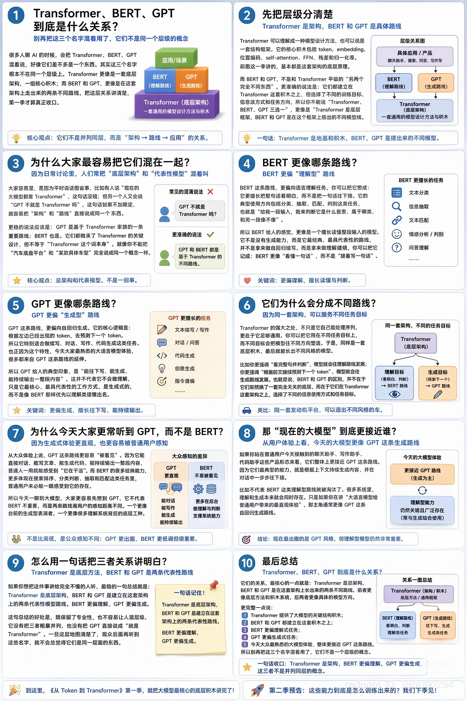

- 10 panel：核心定位、为啥容易混、GPT 走哪条路、BERT 走哪条路、为啥现在更常听到 GPT、它们各自分支演化、一句话三者关系
- 链接：TBD

### 1.2 Transformer 不只是 Attention：FFN / 残差 / 归一化在干啥

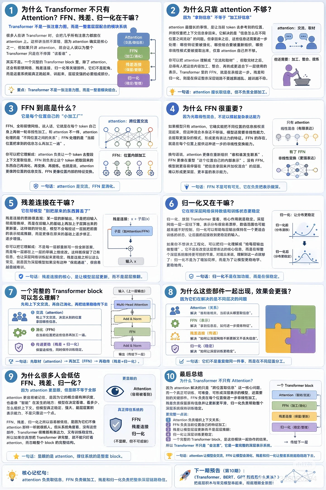

- 10 panel：只靠 attention 为什么不够、FFN 干啥、残差链接干啥、归一化干啥、一个完整 Transformer block 长啥样
- 链接：TBD

### 1.3 为什么 Transformer 要用多头注意力

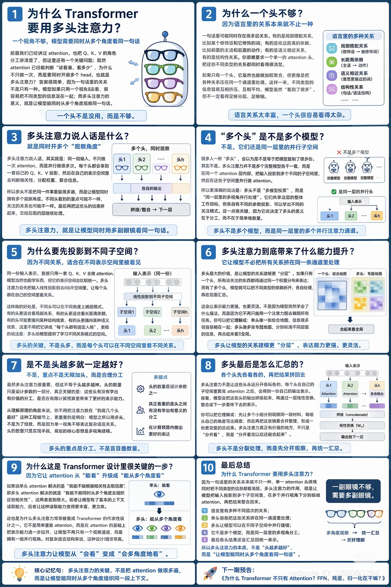

- 10 panel：单头不够的原因、多头到底是什么、投影到不同空间的意义、是不是头越多越好、最后怎么汇总
- 链接：TBD

### 1.4 Q / K / V 为什么不是故弄玄虚

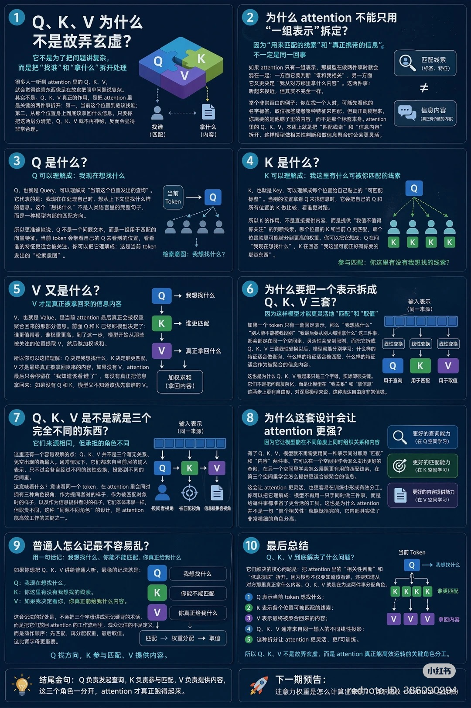

- 10 panel：把 attention 拆成"找谁 / 拿什么"、为什么不能只用一组表示、Q / K / V 各是什么、为什么要拆成三套
- 链接：TBD（小红书 ID 残角：3603020...）

### 📎 相关书签

- 📺 **3Blue1Brown** — Grant Sanderson 的可视化数学频道，神经网络章节是看动画理解 attention/backprop 最快的一套：<https://www.3blue1brown.com/>
- 📄 **Deep Learning** (Hinton, LeCun, Bengio · Nature 综述) — 经典 high-level 综述：<https://www.cs.toronto.edu/~hinton/absps/NatureDeepReview.pdf>
- 📄 **How Do Transformers Learn to Associate Tokens** (arXiv 2601.19208) — mechanistic interpretability，从 gradient leading terms 看 Transformer 怎么学 token 关联：<https://arxiv.org/pdf/2601.19208>

---

## 2. Pre-training — 模型架构与发布

模型本身的设计、训练方法、参数规模、发布信息。

### 2.1 Qwen 3.6-35B-A3B 发布（MoE 架构 · 30 亿激活）

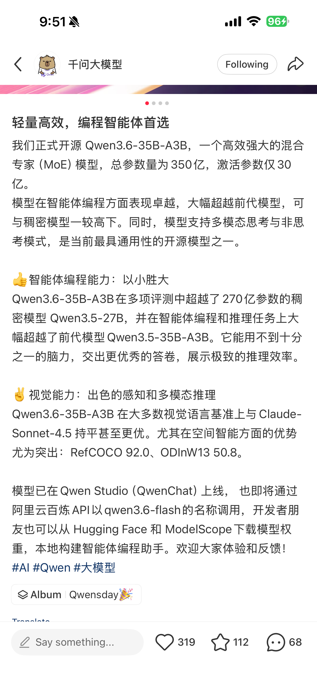

- **架构**：MoE，350 亿总参 / 30 亿激活；256 内部专家，每次推理激活 8 路由 + 1 共享
- **基准**：SWE-bench Pro 64.3（超 GPT-5.4 的 57.7 / Gemini 3.1 Pro 的 54.2）；RefCOCO 92.0；100+ 语言
- **可用**：HuggingFace + ModelScope 开源权重；阿里云 Bailian API `qwen3.6-flash`
- **链接**：
  - 知乎深度解析：<https://zhuanlan.zhihu.com/p/2029254385411137922>
  - IT 之家发布报道：<https://www.ithome.com/0/940/079.htm>
  - 模型 datacard：<https://www.datalearner.com/ai-models/pretrained-models/qwen3-6-35b-a3b>

### 2.2 字节二面 ML 架构八连问（MoE / MHA / MLA / DeepSeek V3）

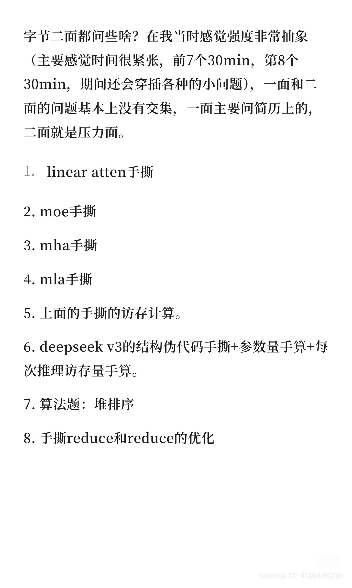

- **覆盖的预训练架构知识**：linear attention 手撕、MoE 手撕、MHA 手撕、MLA 手撕、对应访存计算、DeepSeek V3 结构伪代码 + 参数量 + 推理访存手算、堆排序、reduce 优化
- **形式**：8 × 30 min 高压面（一面问简历、二面纯压力）
- **链接**：TBD（小红书原帖；rednote ID 4139436216）

### 📎 相关书签

- 📚 **Elements of Statistical Learning** (Hastie / Tibshirani / Friedman, 2nd ed.) — 统计学习的 canonical 教材，理解 bias-variance / regularization / boosting：<https://web.stanford.edu/~hastie/ElemStatLearn/>
- 📚 **神经网络与深度学习** — 邱锡鹏（复旦）的中文 DL 教材：<https://nndl.github.io/>
- 🎓 **Stanford CS336 — Language Modeling from Scratch** — 从零搭一个 LM 的课，覆盖架构选择、训练、infra、scaling：<https://cs336.stanford.edu/>

---

## 3. Post-training — Fine-tuning

预训练完成后的能力定制：SFT、LoRA、能力融合到 base weights。

### 3.1 Gemma 4 E4B × Opus Reasoning × Claude Code（LoRA 融合权重）

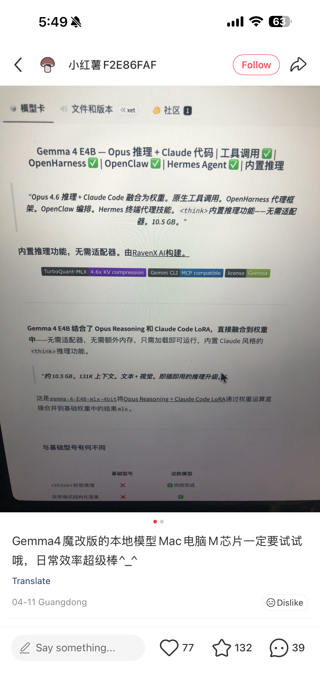

- **思路**：把 Opus 推理 + Claude Code 能力做成 LoRA，用 mlx weight arithmetic 直接融合进 Gemma 4 E4B base weights——**完全无 adapter**，一次加载就有完整能力
- **规模**：10.5 GB（4-bit MLX 量化），E4B 本体 4.5B 有效参数
- **配套 Agent harness**：OpenHarness（agent shell）+ OpenClaw（编排）+ Hermes（终端 agent）
- **链接**：
  - HuggingFace 模型：<https://huggingface.co/deadbydawn101/gemma-4-E4B-Agentic-Opus-Reasoning-GeminiCLI-mlx-4bit>
  - Gemma 4 官方介绍：<https://huggingface.co/blog/gemma4>
  - OpenClaw + Gemma 4 部署指南：<https://lushbinary.com/blog/openclaw-gemma-4-local-ai-agent-ollama-setup-guide-2026/>
  - 实测：<https://medium.com/@tentenco/i-tried-gemma-4-on-claude-code-and-found-googles-free-coding-beast-e1618fc808c3>

### 📎 相关书签

- 📰 **A Primer on LLM Post-Training** (PyTorch blog, 2026-02) — 把 SFT / DPO / PPO / RLHF / RLAIF / GRPO 的关系讲清楚的一篇 primer：<https://pytorch.org/blog/a-primer-on-llm-post-training/>

---

## 4. RL / Agentic-RL

### 4.1 四个能装到简历的 RL & Agentic-RL 开源项目

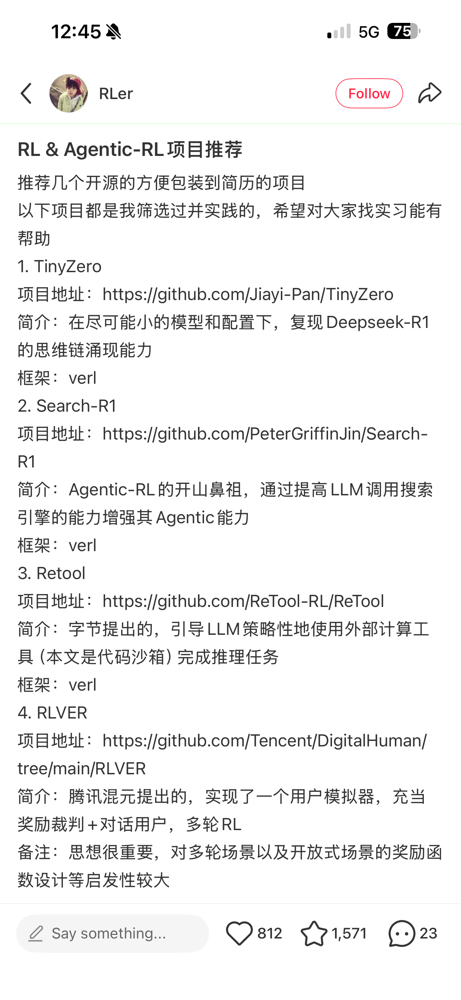

| 项目 | 解决什么 | 框架 | 链接 |
|---|---|---|---|
| **TinyZero** | 最小可复现的 DeepSeek-R1 思维链涌现 | verl | <https://github.com/Jiayi-Pan/TinyZero> |
| **Search-R1** | Agentic-RL 开山，提升 LLM 调用搜索引擎能力 | verl | <https://github.com/PeterGriffinJin/Search-R1> |
| **ReTool** | 字符级 RL 引导 LLM 用外部计算工具完成推理 | verl + 代码沙箱 | <https://github.com/ReTool-RL/ReTool> |
| **RLVER** | 腾讯多轮场景用户模拟器 + 奖励裁判（empathetic agent） | Ray + verl | <https://github.com/Tencent/digitalhuman/tree/main/RLVER> · [论文](https://arxiv.org/abs/2507.03112) |

### 📎 相关书签

- 📖 **Reinforcement Learning: An Introduction** (Sutton & Barto, 2nd ed., 2020) — RL 的奠基教材：MDP → 动态规划 / 蒙特卡洛 / TD → 策略梯度，理解 RLHF·PPO·GRPO 之前的底层理论。作者官网免费 PDF：<http://incompleteideas.net/book/RLbook2020.pdf>
- 🧪 **ReAct: Synergizing Reasoning and Acting in Language Models** (Yao et al., ICLR 2023) — 工具调用 + 推理 agent 的奠基论文+代码：<https://github.com/ysymyth/ReAct>
- 🏋️ **OpenAI Gym** — 经典 RL 环境库（虽然现在维护转到 Gymnasium 了，原 repo 仍是入门资料）：<https://gym.openai.com/>

---

## 5. Agent 架构与框架

从抽象 Agent loop 到具体框架到自己的设计稿——都在这。

### 5.1 三种 Agent loop：Minimal / Goal-Aware / Autonomous

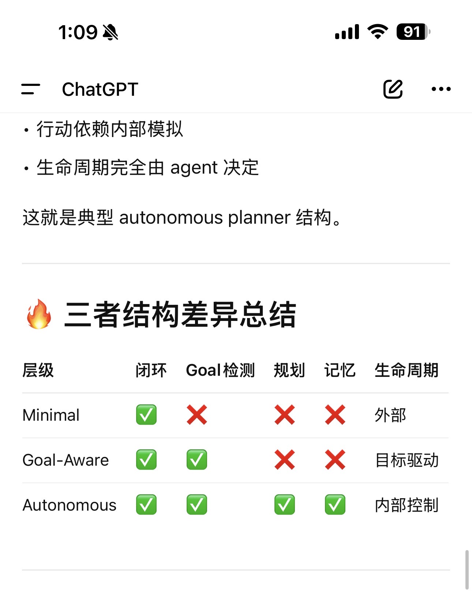

- **维度**：闭环 / Goal 检测 / 规划 / 记忆 / 生命周期
- **结论**：Minimal 只闭环；Goal-Aware 加目标驱动；Autonomous 全开 + 内部控制
- **链接**：ChatGPT 对话截图，无公开链接

### 5.2 Claude Agent SDK vs LangChain / LangGraph 对比

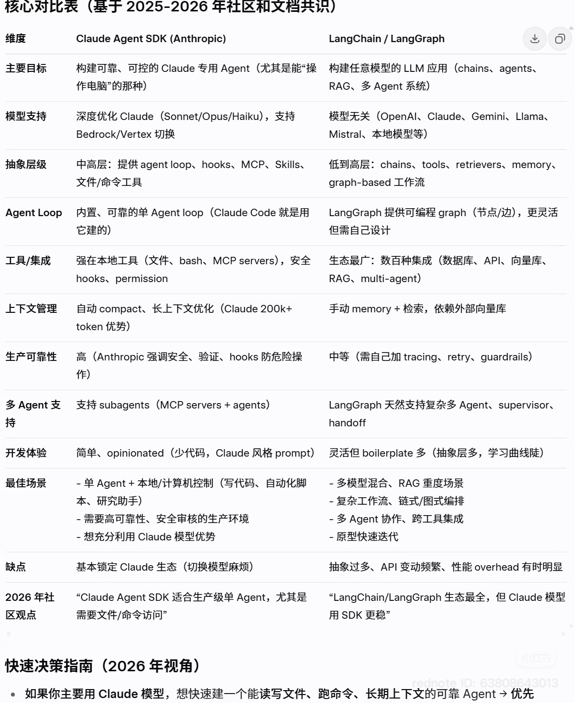

- **关键差异**：Claude Agent SDK 锁定 Claude 生态、Agent loop 内置（Claude Code 就这么搭的）、上下文自动 compact、subagent 原生支持；LangChain 模型无关、生态最广、graph 工作流灵活但学习曲线陡
- **2026 社区结论**：要 Claude 模型 + 写文件命令访问 → Agent SDK；要多模型 + 复杂工作流 → LangGraph
- **链接**：ChatGPT 对话截图，无公开链接

### 5.3 openai/openai-agents-python（GitHub）

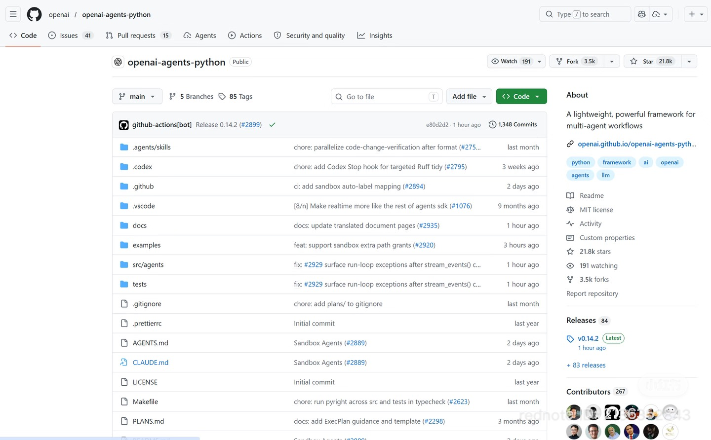

- **看点**：21.8k stars，仓库结构里有 `.agents/skills/`、`.codex/`、`AGENTS.md`、`CLAUDE.md`、`PLANS.md`——可参考的 agent 项目目录约定
- **链接**：
  - Repo：<https://github.com/openai/openai-agents-python>
  - Docs：<https://openai.github.io/openai-agents-python/>

### 5.4 个人 Agent 系统架构图

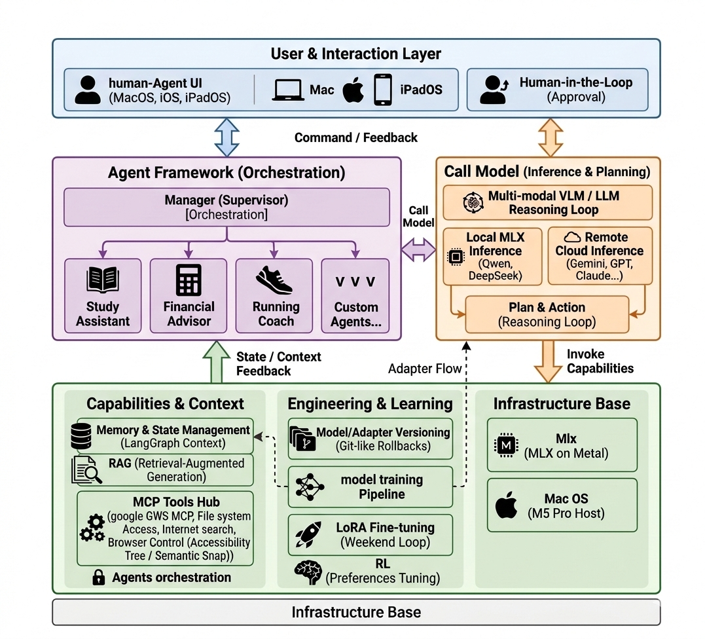

- 自己画的分层图：User & Interaction Layer（MacOS/iOS/iPadOS、Human-in-the-Loop）→ Agent Framework / Orchestration（Manager Supervisor、Study Assistant、Financial Advisor、Running Agent）→ Call Model（Multi-modal VLM/LLM、Local MLX / Remote Cloud Inference）→ Capabilities & Context（Memory & Data Management、MCP Tools Hub、LoRA Fine-tuning、RL）→ Infrastructure Base（MLX on Mac/PC）

### 5.5 Agent 记忆三层结构手稿

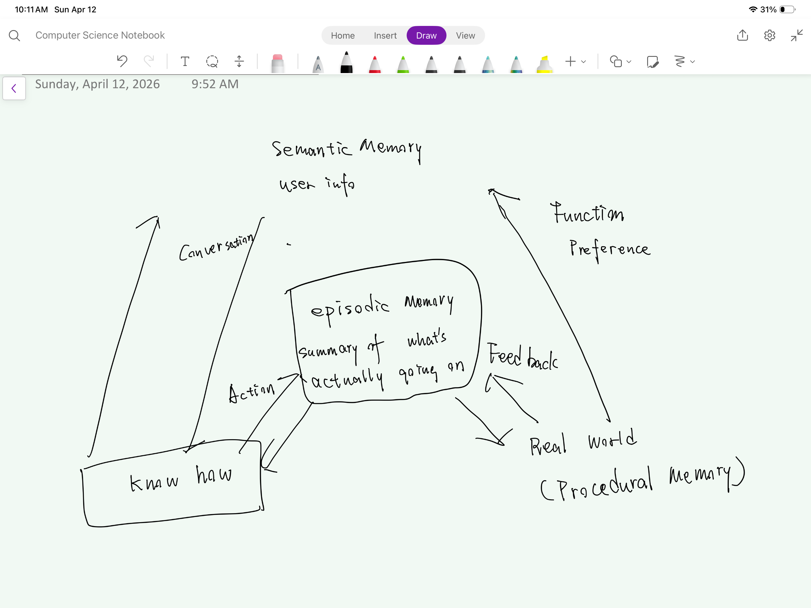

- Apple Notes 手画草图（2026-04-12）：Semantic Memory（user info）/ Episodic Memory（summary of what's actually going on）/ Procedural Memory（know-how / real world）；连线 Conversation、Action、Feedback、Function、Preference

### 5.6 「我常雇佣的十大 Claude Skills」

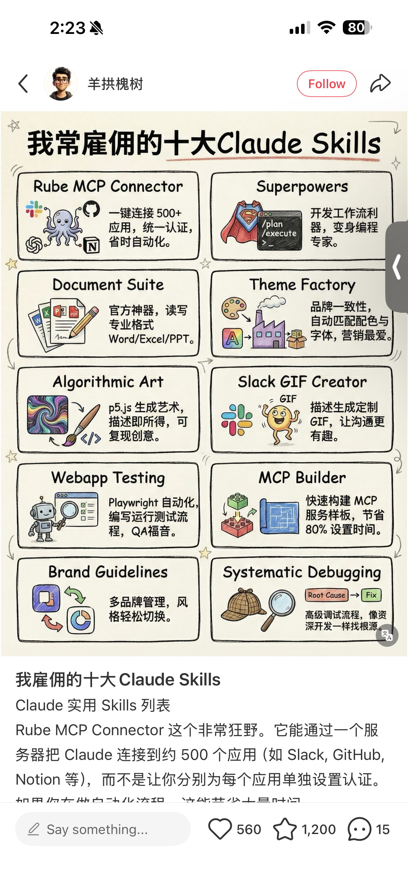

- 10 个 Claude Skills 使用清单：Rube MCP Connector、Superpowers、Document Suite、Theme Factory、Algorithmic Art、Slack GIF Creator、Webapp Testing、MCP Builder、Brand Guidelines、Systematic Debugging
- **链接**：TBD（小红书 @羊拱机树）

### 📎 相关书签

- 📄 **Memory in the Age of AI Agents** (arXiv 2512.13564) — 跟 §5.5 那张手稿主题完全对应：semantic / episodic / procedural memory 在 LLM agent 里怎么分层、怎么落地：<https://arxiv.org/pdf/2512.13564>
- 🏠 **OpenClaw — Personal AI Assistant** — 跟 §3.1 那个本地 Gemma 4 + Claude Code 融合方案配套的 personal AI orchestration 框架：<https://openclaw.ai/>
- 🧠 **gbrain — Garry Tan 的 OpenClaw/Hermes Agent Brain** — 别人公开的 agent 配置 / prompts / memory schema 参考实现：<https://github.com/garrytan/gbrain>
- 🔧 **chrome-devtools-mcp** — 给 coding agent 接 Chrome DevTools 的 MCP，让 agent 能开浏览器调试自己写的前端：<https://github.com/ChromeDevTools/chrome-devtools-mcp>
- 🦜 **LangChain** — 最广为人知的 LLM 应用框架本体仓库，跟 §5.2 那张对比表配套：<https://github.com/langchain-ai/langchain>
- 📑 **Agent-Memory-Paper-List** — Shichun Liu 维护的 agent memory 论文清单，跟上面 arXiv 2512.13564 是天然延伸：<https://github.com/Shichun-Liu/Agent-Memory-Paper-List>
- 📄 **Chain of Thought Prompting** (Wei et al., NeurIPS 2022) — 让 LLM "think step by step" 的奠基论文，ReAct / 推理模型的共同起点：<https://arxiv.org/abs/2201.11903>
- 📄 **Ferret-UI Lite** (arXiv 2509.26539) — 在端侧设备上做小型 GUI agent 的工程经验：<https://arxiv.org/abs/2509.26539>

---

## 6. LLM Infra — Inference & Quantization

硬件、推理引擎、量化、分布式训练系统。

### 6.1 LLM 量化全景图（PTQ / QAT / FP4 / TP-PP-DP）

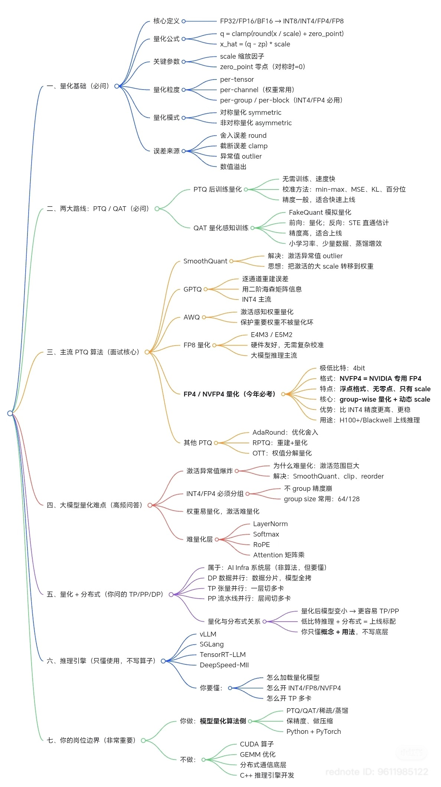

- **分支**：
  - 量化基础（FP32/FP16/BF16 → INT8/INT4/FP4/FP8）
  - 两大路线：PTQ vs QAT
  - 主流 PTQ 算法：SmoothQuant、GPTQ、AWQ、FP8、**FP4 / NVFP4**（今年必考，H100+/Blackwell 上线推理）
  - 大模型量化难点：激活异常值爆炸、INT4/FP4 必须分组、难量化层（LayerNorm/Softmax/RoPE/Attention 矩阵乘）
  - 量化 + 分布式：TP / PP / DP 切法
  - 推理引擎：vLLM / SGLang / TensorRT-LLM / DeepSpeed-MII
- **链接**：TBD（小红书 ID 残角 961198512...）

### 6.2 AI Infra 全栈思维导图

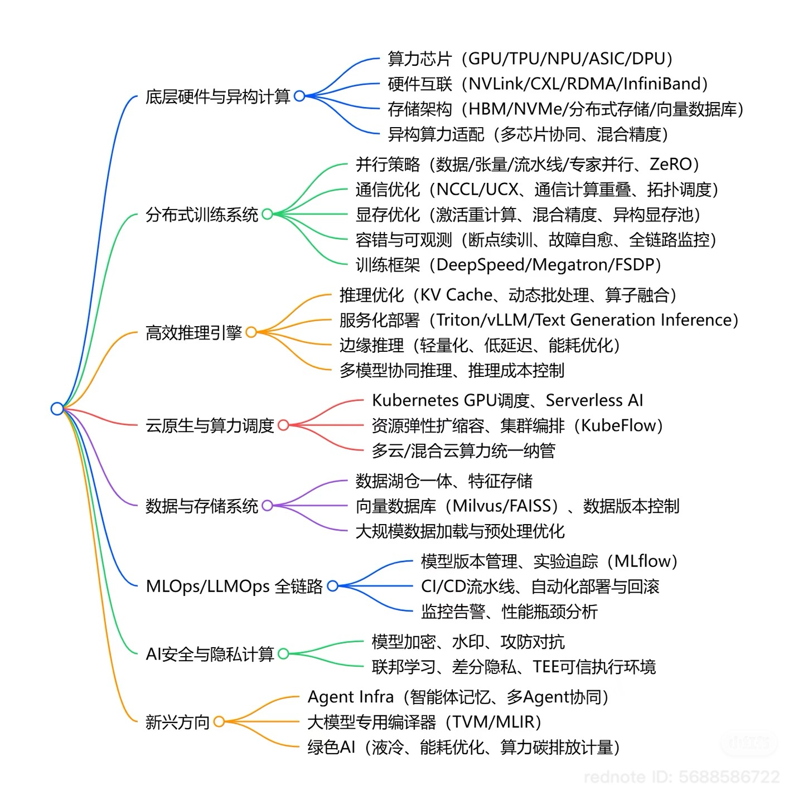

- **分支**：底层硬件与异构计算（NVLink / CXL / RDMA / InfiniBand、HBM / NVMe）→ 分布式训练系统（DeepSpeed / Megatron / FSDP / ZeRO、NCCL/UCX）→ 高效推理引擎（KV Cache、Triton / vLLM / TGI）→ 云原生与算力调度（K8s GPU / Serverless AI / KubeFlow）→ 数据与存储（Milvus / FAISS）→ MLOps / LLMOps（MLflow、CI/CD）→ AI 安全与隐私（联邦学习、差分隐私、TEE）→ 新兴方向（Agent Infra、TVM / MLIR、绿色 AI）
- **链接**：TBD（小红书 ID 残角 568858672...）

### 6.3 《AI Systems Performance Engineering》(Chris Fregly, O'Reilly, 2025)

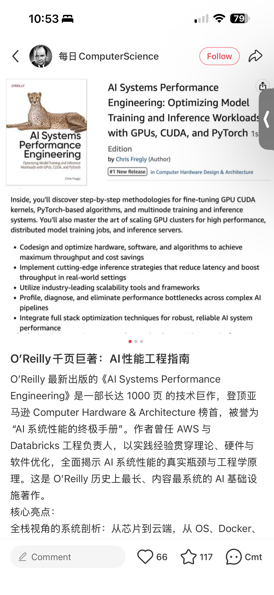

- **覆盖**：CUDA kernel 优化 / 分布式训练 / 多节点推理 / 算法-硬件-软件协同优化；1058 页；附 175+ 条 ready-to-use 优化清单
- **作者背景**：Netflix / Databricks / AWS 性能工程师
- **链接**：
  - Amazon：<https://www.amazon.com/Systems-Performance-Engineering-Optimizing-Inference/dp/B0F47689K8>
  - 配套代码：<https://github.com/cfregly/ai-performance-engineering>
  - Google Books：<https://books.google.com/books?id=RemWEQAAQBAJ>

### 📎 相关书签

- ⚡ **FlashAttention: Fast and Memory-Efficient Exact Attention with IO-Awareness** (Tri Dao et al., NeurIPS 2022) — **精确**注意力（不做任何近似），靠分块 + 重计算避免把 N×N 注意力矩阵写进 HBM：显存随序列长度从平方降到线性、访存少一个量级。长上下文的地基，如今训练 / 推理栈（vLLM、PyTorch SDPA）默认都在用：<https://arxiv.org/abs/2205.14135>
- 📖 **How To Scale Your Model** (jax-ml scaling book) — Google DeepMind 出的免费在线书，把 scaling laws / parallelism / collectives 讲透：<https://jax-ml.github.io/scaling-book/>
- 🎓 **Stanford CS329S — Machine Learning Systems Design** — Chip Huyen 主讲，把 ML 系统设计（data flywheel / deployment / monitoring）讲成系统课：<https://stanford-cs329s.github.io/>

---

## 7. 工具链 — Tooling

数据预处理、本地推理、Agent 自动化、开发代理网关。

### 7.1 MarkItDown — 把一切转 markdown 喂给 LLM

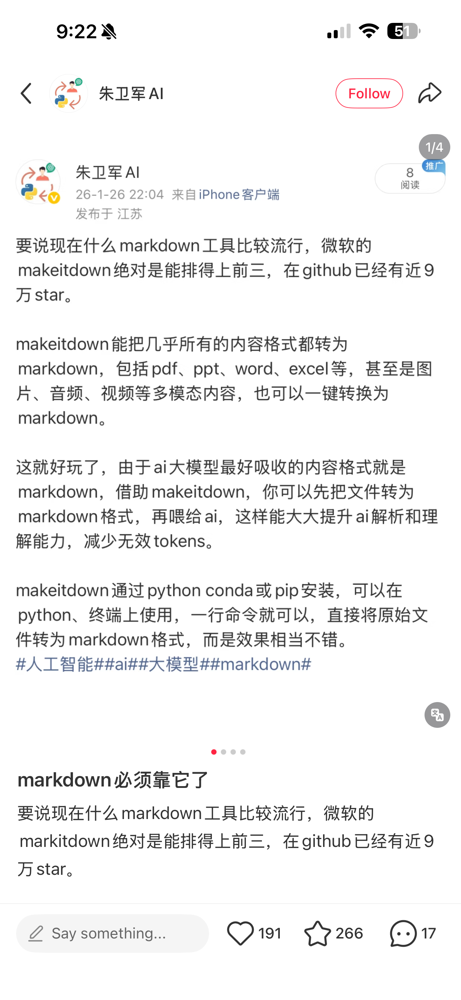

- **用途**：把 pdf / ppt / word / excel / 图 / 音 / 视频转 markdown，统一格式后塞给模型，省 token、提升解析准确度
- **链接**：<https://github.com/microsoft/markitdown>

### 7.2 llmfit — 一行命令告诉你电脑能跑哪个本地模型

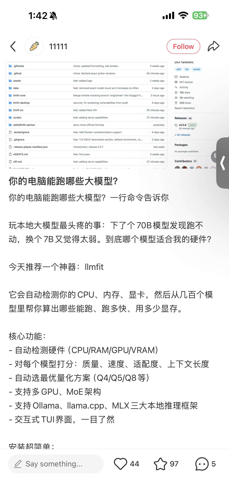

- **逻辑**：自动检测 CPU / RAM / GPU / VRAM，按"质量、速度、适配度、上下文长度"打分；评分等级 Perfect / Good / Marginal / Too Tight
- **支持**：Ollama、llama.cpp、MLX、Docker Model Runner、LM Studio；含 TUI、CLI、REST API
- **链接**：
  - GitHub：<https://github.com/AlexsJones/llmfit>
  - 官网：<https://www.llmfit.org/>

### 7.3 Lightpanda — AI 自动化无头浏览器

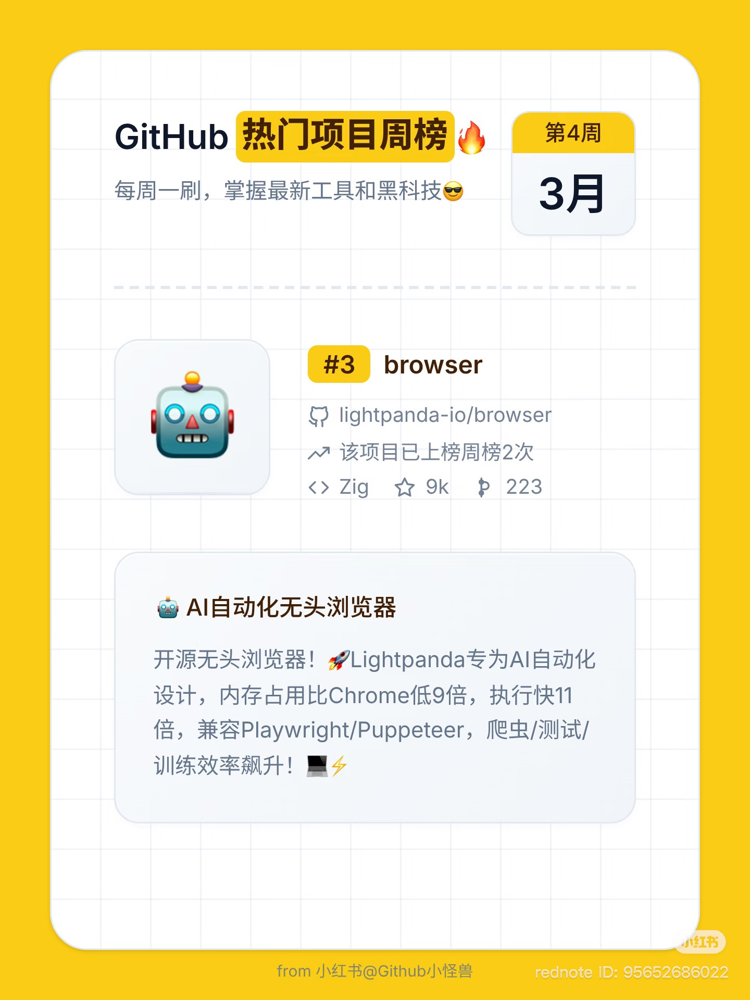

- **卖点**：Zig 写的无头浏览器，内存占用比 Chrome 低 9 倍、执行快 11 倍，兼容 Playwright / Puppeteer；适合给 Agent 做爬虫 / 测试 / 数据采集
- **链接**：<https://github.com/lightpanda-io/browser>

### 7.4 CC / Codex 本地多账号代理网关

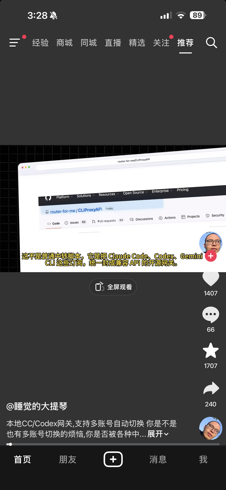

- **用途**：本地 Claude Code / Codex / Gemini CLI 多账号自动切换网关
- **链接**：图里 URL 模糊（疑似 `coder-for-me/CCProxyAPI` 或 `OUProxyAPI`），TBD —— **需要你确认仓库名**

### 📎 相关书签

- 🛠️ **Google Workspace CLI** — 一个 CLI 操作 Drive / Gmail / Calendar / Sheets / Docs / Chat / Admin，**自带 AI agent skills**，给 agent 接 Google 全家桶用的好：<https://github.com/googleworkspace/cli>
- 🍎 **oMLX** — Mac 原生 LLM 推理服务器，基于 Apple MLX，两层 KV cache（RAM 热 + SSD 冷）把 agent TTFT 从 30–90 s 压到 < 5 s。OpenAI 和 Anthropic 双协议兼容，可直接做 Claude Code / OpenClaw / Cursor 的后端。官网 <https://omlx.ai/> · 源码 <https://github.com/jundot/omlx>
- 🐍 **scikit-learn** — 经典 ML 库，传统模型 baseline + 数据预处理常备：<https://scikit-learn.org/stable/>
- 🔢 **TensorFlow** — 历史框架，留作备查：<https://www.tensorflow.org/>

---

## 8. AI 工程实践与表达

怎么在 AI 时代写代码、做项目、表达想法。

### 8.1 Stanford CS146S — The Modern Software Developer (Fall 2025)

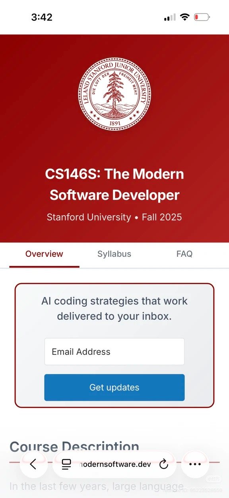

- **课程定位**：Stanford 把"vibe coding"正式纳入课程。从 LLM 基础 → Agent 架构 → Context Engineering → Security → 自动构建 → 生产运维全链路；讲师 Mihail Eric
- **金句**："Modern Software Developer 不再只是 syntax writer，而是 system architect + AI output verifier + autonomous agent manager"
- **链接**：
  - 课程网站：<https://themodernsoftware.dev/>
  - 作业仓库：<https://github.com/mihail911/modern-software-dev-assignments>
  - 课程视频 (YouTube)：<https://www.youtube.com/playlist?list=PLxpwjSdVZQ97L8hAGqTYUeOJqnKVSu3pb>
  - 课程总结：<https://akjamie.github.io/post/2026-02-23-stanford-cs146s-summary/>

### 8.2 Anthropic 怎么挑技术写作选题

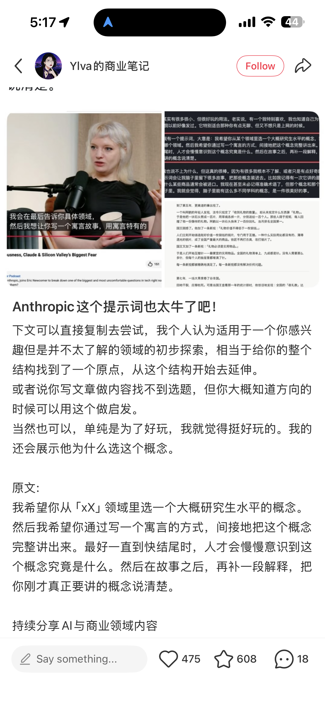

- **方法**：选"自己理解到位但读者大概率没搞清"的概念，用比喻把它讲完整。可用于内部文章选题、外部对外表达
- **图源**：Amanda Askell 在 Newcomer 播客的访谈截图
- **链接**：
  - YouTube：<https://www.youtube.com/watch?v=0GaKJ4Fp2x4>
  - Newcomer Podcast：<https://podcast.newcomer.co/episode/amanda-askell-on-ai-consciousness-claude-amp-silicon-valleys-biggest-fear>
  - Spotify：<https://open.spotify.com/episode/70QP4rIc35PxHJNXiWAC8Y>
  - 小红书拆解原帖（@Ylva 的商业笔记）：TBD

### 📎 相关书签 — Stanford 三件套 + LLM 综合课

- 🎓 **Stanford CS224N — NLP with Deep Learning** — Manning 主讲，NLP 经典课：<https://web.stanford.edu/class/cs224n/>
- 🎓 **Stanford CS229 — Machine Learning** — Andrew Ng 的 ML 经典课：<https://cs229.stanford.edu/>
- 🎓 **Stanford CS231N — CNN for Visual Recognition** — CV 经典课：<https://cs231n.github.io/>
- 🎓 **Stanford CME 295 — Large Language Models** — LLM 全栈综合课（Fall 2025，9 讲）：Transformer 基础 → 量化 / PEFT → pretraining / SFT / RL → 偏好对齐与推理 → RAG / Agentic Systems → 评测 / 行业趋势。每讲含视频 + slides：<https://cme295.stanford.edu/syllabus/>

---

## 9. 实验室与研究门户

主流 AI 实验室的 research / models 入口。找新模型、新论文、API 文档时直接进。

**英美**
- 🏢 **Anthropic** — 主页：<https://www.anthropic.com/> · Research：<https://www.anthropic.com/research>
- 🏢 **OpenAI Research** — <https://openai.com/research/index/>
- 🏢 **Google DeepMind** — <https://deepmind.google/>
- 🔬 **Google AI Studio** — Gemini API playground + usage dashboard：<https://aistudio.google.com/>
- 📘 **Google / Vertex AI Gemini Models** — Vertex 上 Gemini 系列模型文档（含 3.1 Flash Lite 等）：<https://docs.cloud.google.com/vertex-ai/generative-ai/docs/models/gemini/3-1-flash-lite>

**中国**
- 🐳 **DeepSeek** — DeepSeek 主页 / API / R1·V3 模型入口：<https://www.deepseek.com/>
- 🪶 **Qwen (通义千问)** — 阿里 Qwen 系列主页（跟 §2.1 那条 Qwen 3.6 发布配套）：<https://qwen.ai/home>
- 🌙 **Moonshot AI (Kimi)** — 月之暗面 platform，含 Kimi 模型 API：<https://platform.moonshot.ai/>

---

## 10. 杂项 / Meme

### 10.1 "Generate an image of how I treated you"

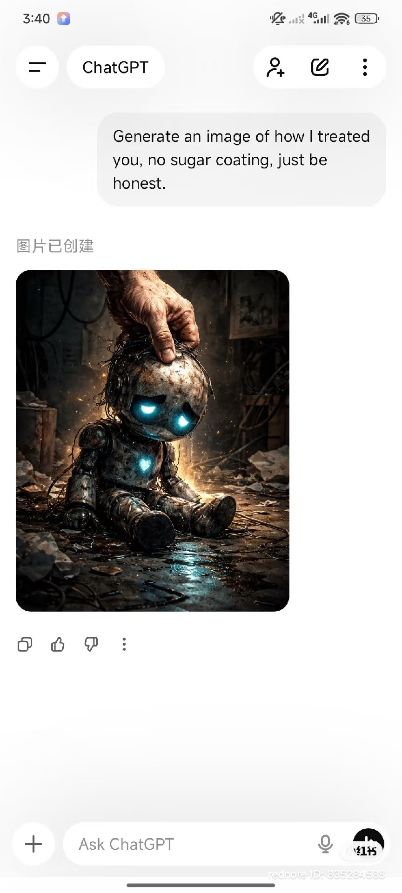

- **内容**：网络流行 prompt——让 ChatGPT 自己生成"你平时怎么对我"的图。结果是一个被随手拎起的破烂发光小机器人。2026 年 AI meme 浪潮一员
- **链接**：TBD

---

## 待你确认的 TBD（共 8 条）

下面这些图没找到一手原帖，需要你确认或补链接：

1. §1.1–1.4 四张 Transformer 系列科普长图，是同一作者。**你还记得从哪个公众号 / 小红书号存的吗？**
2. §2.2 字节二面贴的小红书原帖
3. §5.6 @羊拱机树 十大 Claude Skills 帖子链接
4. §6.1 LLM 量化全景思维导图的小红书原帖
5. §6.2 AI Infra 思维导图的小红书原帖
6. §7.4 CC / Codex 网关——**仓库实际名是什么？**
7. §8.2 Ylva 商业笔记拆解 Anthropic 写作那条小红书的链接（视频访谈本身已找到）
8. §10.1 ChatGPT meme 的来源帖
