# LC Coverage Framework

LeetCode 解题框架：按**题干 → 数据结构 → 算法**推断方法，配代表题 + 连线图。

> **目标函数**：在面试白板前，30 秒内把陌生题从题干归到方法，对应一道代表题。
>

---

## 1. 从题干推断方法：题干 → 数据结构 → 算法

面试真实流程：先看到**题干**，再看到**数据结构**，最后**推断算法**——没人上来就告诉你该用什么算法。这套框架按这个顺序组织：题干在最顶层（归入意图 block A–K），中间看数据结构，右边落到算法。

**怎么用**：

1. 读题干 → 归入一个意图 block（A–K）
2. 看数据结构那一列
3. 连到算法

**只有 block A（求最优）需要靠数据结构在内部岔开**；其余 block 基本「一个 block ≈ 一个算法」，看到题干就能落（见 §3 规律）。

---

## 2. 主表（按意图 block 分组，每格一道代表题）

### A · 求最优（最大 / 最小 / 最长 / 最短）— 唯一一个内部按 DS 散射的 block
| 题干 | 数据结构 | 算法 | 代表题（做） | 其他例 |
|---|---|---|---|---|
| 连续子段最长/最短满足条件 | 数组/字符串 | 滑窗 | **3** 无重复最长子串 | 76, 424 |
| 最大化最小 / 最小化最大 / 最小可行值 | 答案空间 | 二分答案 | **875** Koko | 410, 1011, 1552 |
| 无权图/网格最短路 | 图/网格 | BFS | **1091** 二进制矩阵最短路 | 127 |
| 网格最小/最大路径 | 网格 | 网格 DP | **64** 最小路径和 | 62, 931 |
| 一路扫最大收益 / 最大子段和 | 数组 | 扫描/DP(累积) | **121** 买卖股票 | 53, 122/123/188 |
| 序列最优 + 子问题重叠 | 数组/字符串 | DP | **322** 零钱 | 72, 300 |

### B · 找一个 / 定位
| 题干 | 数据结构 | 算法 | 代表题（做） | 其他例 |
|---|---|---|---|---|
| 有序数组里找 target | 有序数组 | 二分 | **704** 二分查找 | 33, 35 |
| 有序里找一对求和 | 有序数组 | 对撞双指针 | **167** 两数之和 II | 15 |
| 找环 / 找重复数 | 链表 / 数组当链表 | 快慢指针 | **287** 寻找重复数 | 141, 142 |

### C · 枚举所有
| 题干 | 数据结构 | 算法 | 代表题（做） | 其他例 |
|---|---|---|---|---|
| 所有 组合/排列/子集/分割 | 决策树(数组/树) | 回溯 | **78** 子集 | 46, 39, 131, 17 |
| 网格里搜所有匹配路径 | 网格 | 回溯(+Trie) | **79** 单词搜索 | 212 |

### D · 计数
| 题干 | 数据结构 | 算法 | 代表题（做） | 其他例 |
|---|---|---|---|---|
| 多少种走法 / 方案数 | 数组/网格/字符串 | DP 计数 | **62** 不同路径 | 518, 91 |

### E · 第 k
| 题干 | 数据结构 | 算法 | 代表题（做） | 其他例 |
|---|---|---|---|---|
| 第 k 大/小（静态） | 数组 | 堆 / 快速选择 | **215** 第 k 大 | 347 |
| 第 k / 中位数（流） | 流 | 堆 / 双堆 | **295** 数据流中位数 | 703 |

### F · 前后关系 / 依赖
| 题干 | 数据结构 | 算法 | 代表题（做） | 其他例 |
|---|---|---|---|---|
| next greater / smaller | 数组序列 | 单调栈 | **739** 每日温度 | 496, 84, 503 |
| 先修 / 依赖 / build order | 图(DAG) | 拓扑排序 | **207** 课程表 | 210, 269 |

### G · 分组 / 连通
| 题干 | 数据结构 | 算法 | 代表题（做） | 其他例 |
|---|---|---|---|---|
| 连通块 / 岛屿 / 省份 | 图/网格 | flood(BFS/DFS) 或 并查集 | **200** 岛屿数量 | 547, 721 |
| 区间合并 / 重叠 | 区间 | 排序 + 扫描线 | **56** 合并区间 | 435, 252 |

### H · 匹配 / 嵌套
| 题干 | 数据结构 | 算法 | 代表题（做） | 其他例 |
|---|---|---|---|---|
| 括号匹配 / 嵌套合法 | 栈 | stack | **20** 有效括号 | 32, 394 |

### I · 按规则遍历 / 产出顺序
| 题干 | 数据结构 | 算法 | 代表题（做） | 其他例 |
|---|---|---|---|---|
| 螺旋 / 蛇形按序输出 | 网格 | 模拟(方向 cursor) | **54** 螺旋矩阵 | 59, 885 |
| 层序 / 前中后序 | 树 | BFS / DFS 遍历 | **102** 层序遍历 | 94, 144 |

### J · 字符串
| 题干 | 数据结构 | 算法 | 代表题（做） | 其他例 |
|---|---|---|---|---|
| 前缀 / 字典查找 | 字符串集合 | Trie | **208** 实现 Trie | 212, 648 |
| 最长回文 | 字符串 | 中心扩展 / DP | **5** 最长回文子串 | 647 |

### K · 子数组和 / 前缀
| 题干 | 数据结构 | 算法 | 代表题（做） | 其他例 |
|---|---|---|---|---|
| subarray 和 = k | 数组 | 前缀和 + 哈希 | **560** 和为 k 的子数组 | 523 |

### 连线图（题干×DS → 算法）

左边每个「题干 · 代表题」连到右边算法。**蓝色 = 枢纽**（多条线汇入），其余是叶子（1:1）。一眼能看出 DP / BFS·DFS / 二分 / 回溯 收了大量线。

```mermaid
flowchart LR
  subgraph A["A · 求最优 optimize"]
    t1["Longest substring meeting a condition · #3"]
    t2["Minimize the max / smallest feasible value · #875"]
    t3["Fewest steps, unweighted graph or grid · #1091"]
    t4["Cheapest path through a grid · #64"]
    t5["Best buy-sell profit over one sweep · #121"]
    t6["Best over a sequence, overlapping subproblems · #322"]
  end
  subgraph B["B · 找/定位 locate"]
    t7["Find target in a sorted array · #704"]
    t8["Find a pair summing to target · #167"]
    t9["Detect a cycle / find the duplicate · #287"]
  end
  subgraph C["C · 枚举 enumerate"]
    t10["List all subsets / permutations · #78"]
    t11["Search all matching paths in a grid · #79"]
  end
  subgraph D["D · 计数 count"]
    t12["Count how many ways / paths · #62"]
  end
  subgraph E["E · 第k k-th"]
    t13["K-th largest, or median of a stream · #215"]
  end
  subgraph F["F · 顺序/依赖 order"]
    t14["Next greater / smaller element · #739"]
    t15["Prerequisite / build order · #207"]
  end
  subgraph G["G · 分组/连通 group"]
    t16["Count connected components / islands · #200"]
    t17["Merge overlapping intervals · #56"]
  end
  subgraph H["H · 匹配 match"]
    t18["Validate nested parentheses · #20"]
  end
  subgraph I["I · 遍历产出 traverse"]
    t19["Output a grid in spiral order · #54"]
  end
  subgraph J["J · 字符串 string"]
    t20["Prefix / dictionary lookup · #208"]
  end
  subgraph K["K · 子数组和 prefix-sum"]
    t21["Subarray sum equals k · #560"]
  end
  t1 --> aSW["Sliding window"]
  t2 --> aBS["Binary search ★"]
  t3 --> aBFS["BFS / DFS ★"]
  t4 --> aDP["DP ★"]
  t5 --> aDP
  t6 --> aDP
  t7 --> aBS
  t8 --> a2P["Two pointers"]
  t9 --> aFS["Fast-slow pointers"]
  t10 --> aBT["Backtracking ★"]
  t11 --> aBT
  t12 --> aDP
  t13 --> aHeap["Heap"]
  t14 --> aMS["Monotonic stack"]
  t15 --> aTopo["Topological sort"]
  t16 --> aBFS
  t17 --> aSweep["Sort + sweep"]
  t18 --> aStack["Stack"]
  t19 --> aSim["Simulation"]
  t20 --> aTrie["Trie"]
  t21 --> aPre["Prefix + hash"]
  classDef hub fill:#E6F1FB,stroke:#185FA5,color:#0C447C;
  class aBS,aBFS,aDP,aBT hub;
```



---

## 3. 两条规律 + do-list

### 规律 1 — 枢纽 vs 叶子（把题干×DS 连到算法，看入度）

| | 入度 | 算法 | 读 DS 吗 | 怎么处理 |
|---|---|---|---|---|
| **枢纽** | ≥ 2 | DP（←4）· BFS/DFS（←2）· 二分（←2）· 回溯（←2） | **必须读** | 题干 → 看 DS → 才能定算法 |
| **叶子** | = 1 | 单调栈 · 拓扑 · Trie · 栈 · 滑窗 · 双指针 · 快慢 · 堆 · 排序+扫描 · 模拟 · 前缀和 | 不用读 | 扳机词 → 直接落 |

- **叶子有扳机词**：next greater→单调栈、prereq→拓扑、括号→栈、prefix→Trie，看到就落，数据结构那列都不用看。
- **枢纽要消歧**：题干流向 DP/BFS·DFS/二分/回溯 时，必须读数据结构来决定走哪条线。
- **认知预算**：80% 投在 4 个枢纽算法 × 数据结构的组合上；叶子是查表。

### 规律 2 — A 是唯一的「散射 block」

block ≈ 题干意图，而**大部分意图 block 跟算法近 1:1**（B→双指针/二分、F→单调栈/拓扑、H→栈…，看到就落）。唯独 **block A（求最优）一个 block 内部就散到 滑窗 / 二分 / BFS / DP 四个算法**，靠数据结构区分。

> 合起来：**全表最需要"读数据结构"的地方就是 block A**，那也是枢纽算法扎堆处；其余 block 看到题干基本就落。

### do-list（每个组合一道，21+ 道）

`3 · 875 · 1091 · 64 · `**`121`**` · 322 · 704 · 167 · 287 · 78 · 79 · 62 · 215 · 295 · 739 · 207 · `**`200`**` · 56 · 20 · `**`54`**` · 102 · 208 · 5 · 560`

> 加粗的 **54 螺旋矩阵**（block I）、**200 岛屿数量**（block G）、**121 买卖股票**（block A）是已经做过的，已归位。浏览 LeetCode 时新题往对应 block 的「其他例」列加；单格 block（D/E/H/I/J/K）会慢慢长起来。

---

## 4. 面试时怎么用：三级漏斗

```
Step 1: 默念 7 个 bucket 动词
        "看到啥就做？沿结构跑？试-失败？框/缩？维护最值？拆子问题？上专用工具？"
        ↓ 缩到一个 bucket

Step 2: 如果落在 #1，再默念 3 个大类
        "照着做？扫一遍维护？想清楚再写？"
        ↓ 缩到一个大类

Step 3: 在大类内部定到 2-3 个子项
        ↓ 拿出模板写代码
```

工作记忆全程**只需要 3-7 个标签**，符合大脑短期记忆容量（Miller's 7±2）。

### 跨 bucket 推荐做题顺序

不是按编号 1→7 做，按**直觉容易度 + 依赖关系**：

```
1 模拟贪心 (1.A 子集 → 1.B → 1.C 顺序)
  ↓
2 遍历 (Grid → Graph → Tree 顺序)
  ↓
3 回溯
  ↓
4 框/缩
  ↓
5 维护最值 (堆 → 单调栈 → 单调队列)
  ↓
6 DP (1D → 2D → 区间 → 状态 → 位掩码)
  ↓
7 特化 DS
```

DP 倒数第二做——它是子问题感最难培养的，需要前面所有训练做铺垫。特化 DS 最后——前面积累的 DS 直觉让你能理解为什么需要专用工具。

---

## 5. 反陷阱规则

LC 上最危险的不是不会做，是**把 #1 题升级处理成 #5/#6/#7**。记住这几条反陷阱规则：

| 题面 framing | 错误本能 | 正确 bucket | 反陷阱规则 |
|---|---|---|---|
| "construct a string with constraint" | backtracking (#3) | #1 1F 频次驱动 | 局部约束 + 频次可数 → 先试贪心 |
| "min count to cover [0, n]" | graph 最短路 (#2) | #1 1D Frontier | "覆盖"+"最少"→ 先试区间贪心 |
| "find max/min over triplets/tuples" | DP (#6) | #1 1C Running 标量 | 几个变量就能维护 → #1 |
| "扫一遍字符串" | 遍历 (#2) | #1 1B 状态机 | 1D 线性扫不是 #2，#2 是 follow 结构边 |
| "操作字符串 / 数组" | 模拟 (#1 1A) | #1 1G 不变量 | 直接模拟会爆炸 → 先找操作的不变量 |
| LC tag 是 "Dynamic Programming" | 真 DP (#6) | 可能是 #1 + 简单递推 | LC tag 噪音多，看认知主干 |

---

## 6. 怎么从"知道框架"到"秒选对工具"

framework 不是终点，是**起点**。从 Stage 3（懂框架）→ Stage 4（10 秒识别）靠这 4 个习惯：

1. **Active retrieval**：每题做完关掉解答，48 小时后强迫回忆 trigger → pattern。**Testing effect 决定一切**。
2. **Trigger → pattern 字典**：每题写一行"看到 X 就用 Y"。攒 50-80 条。
3. **5 秒约束过滤**：先看 `n` 的范围，砍掉 70% 候选 paradigm（n ≤ 20 → bitmask，n ≤ 10⁵ → O(n log n) max）。
4. **错题 → 反陷阱规则**：每次踩坑写一条"这种 framing 不要再选错 bucket"。攒 30-50 条。

**100 道有意识做的题 > 500 道无意识刷的题**。

---

## 附录 A：扩展题（每 bucket 4-5 道，做完主 25 接着刷）

### Bucket 1 各子项扩展

| 子项 | 扩展题 |
|---|---|
| 1A 纯模拟 | Spiral Matrix II (59) · Rotate Image (48) · Game of Life (289) · Set Matrix Zeroes (73) |
| 1B 状态机 | String to Integer atoi (8) · Basic Calculator (224) · Decode String (394) · Simplify Path (71) |
| 1C Running 标量 | Maximum Subarray (53) · Maximum Value of an Ordered Triplet II (2874) · Largest 1-Bordered Square (1139) |
| 1D Frontier | Jump Game (55) · Min Taps (1326) · Video Stitching (1024) |
| 1E 区间 | Merge Intervals (56) · Insert Interval (57) · Meeting Rooms II (253) |
| 1F 频次驱动 | Task Scheduler (621) · String Without AAA or BBB (984) · Reconstruct Original Digits (423) |
| 1G 不变量 | Candy (135) · Container With Most Water (11) · Maximum Binary String After Change (1702) |

### Bucket 2 遍历扩展

- Grid：Word Search (79)、Pacific Atlantic Water Flow (417)
- Graph：Network Delay Time (743, Dijkstra)、Connecting Cities Min Cost (1135, MST)、Critical Connections (1192, Tarjan)
- Tree：Validate BST (98)、Binary Tree Cameras (968)、Lowest Common Ancestor (236)

### Bucket 3 扩展
Sudoku Solver (37) · Word Break II (140) · Word Squares (425) · Prefix and Suffix Search (745)

### Bucket 4 扩展
Median of Two Sorted Arrays (4) · Find Median from Data Stream (295) · Subarrays with K Different Integers (992) · Capacity to Ship Packages (1011)

### Bucket 5 扩展
Daily Temperatures (739) · Next Greater Element II (503) · Sum of Subarray Minimums (907) · Top K Frequent Elements (347)

### Bucket 6 DP 扩展
Partition Equal Subset Sum (416, 背包) · Binary Tree Cameras (968, 树形 DP) · Number of Digit One (233, 数位 DP) · Regular Expression Matching (10) · Jump Game VI (1696, 单调队列优化 DP)

### Bucket 7 扩展
Implement Trie (208) · The Skyline Problem (218) · Range Module (715) · Shortest Palindrome (214, KMP)

---

## 附录 B：框架在 10 道随机题上的验证

整理这套 framework 时实际测试过的 10 道题，全部能精确归类到 bucket + 子项：

| 题 | Bucket | Bucket 1 子项 | 第一直觉陷阱 |
|---|---|---|---|
| [Reconstruct Original Digits (423)](https://leetcode.com/problems/reconstruct-original-digits-from-english/) | #1 | 1F 频次驱动 | ad-hoc |
| [Next Greater Element II (503)](https://leetcode.com/problems/next-greater-element-ii/) | #5 | — | 教科书 |
| [Valid Number (65)](https://leetcode.com/problems/valid-number/) | #1 | 1B 状态机 | 状态机直觉 ✓ |
| [K Highest Ranked Items (2146)](https://leetcode.com/problems/k-highest-ranked-items-within-a-price-range/) | #2 | — | grid BFS + 排序 tail |
| [String Without AAA or BBB (984)](https://leetcode.com/problems/string-without-aaa-or-bbb/) | #1 | 1F 频次驱动 | "看着像 search" |
| [Min Taps (1326)](https://leetcode.com/problems/minimum-number-of-taps-to-open-to-water-a-garden/) | #1 | 1D Frontier | "看着像 graph" |
| [Min Frogs Croaking (1419)](https://leetcode.com/problems/minimum-number-of-frogs-croaking/) | #1 | 1B 状态机 | "看着像遍历" |
| [Triplet II (2874)](https://leetcode.com/problems/maximum-value-of-an-ordered-triplet-ii/) | #1 | 1C Running 标量 | "看着像 #5 / #6" |
| [Largest 1-Bordered Square (1139)](https://leetcode.com/problems/largest-1-bordered-square/) | #1 | 1C' 2D Running | "LC 官方 tag = DP" |
| [Maximum Binary String (1702)](https://leetcode.com/problems/maximum-binary-string-after-change/) | #1 | 1G 不变量 | "看着像 search" |

**10 题里 8 道 #1**——印证 LC 题量分布严重偏 #1，"先按 #1 试" 是高 ROI 策略。

---

## 刷题笔记 · 2026-06-22：Spiral Matrix I / II × Number of Islands

三道网格题，横跨 **Bucket 1.A 模拟** 和 **Bucket 2 遍历**，正好演示"循环骨架什么时候能借、什么时候必须自己驱动 cursor"。

- **Spiral Matrix I (54)** — Bucket 1.A：单 cursor，方向是可变变量，撞墙转向
- **Spiral Matrix II (59)** — 同骨架，"读"换成"写"
- **Number of Islands (200)** — Bucket 2：外层扫描找种子 + 内层 BFS flood

> 约定：统一用 `(r, c)`（行、列），让 tuple 顺序和 `grid[r][c]` 同序、不翻——这是踩了 `(x,y)` vs `grid[y][x]` 交叉接线的坑后总结的习惯。

### Pseudo code

```
# ---- Spiral Matrix I (54)：读出螺旋序 ----
# 1.A 模拟：单 cursor，frontier 恒为 1 个，方向是可变数据
DIRS = [(0,1),(1,0),(0,-1),(-1,0)]      # 右 下 左 上，顺时针
r = c = d = 0
for _ in range(m * n):                  # 固定循环 m*n 次
    res.append(matrix[r][c]); seen[r][c] = True
    nr, nc = r + DIRS[d][0], c + DIRS[d][1]
    if 越界 or seen[nr][nc]:             # 撞墙 → 转向（方向作为数据被改写）
        d = (d + 1) % 4
        nr, nc = r + DIRS[d][0], c + DIRS[d][1]
    r, c = nr, nc                       # 前进：覆盖单 cursor

# ---- Spiral Matrix II (59)：同骨架，"读"换成"写" ----
# 唯一改动：res.append(matrix[r][c])  →  matrix[r][c] = i  （i 从 1 递增）
# 且 res 自身可当 visited（值 ≥ 1 即已访问），省掉 seen 矩阵

# ---- Number of Islands (200)：外层扫描找种子 + 内层 BFS flood ----
# Bucket 2 遍历：frontier 是队列（size 可 > 1），四个邻居全展开
res = 0
for r in range(m):                      # 嵌套扫描，顺序无关 → 最干净
    for c in range(n):
        if grid[r][c] == '1':           # 一块没被淹的陆地 = 一座新岛
            res += 1
            q = deque([(r, c)]); grid[r][c] = '0'
            while q:                     # BFS：把整片连通的 1 淹掉
                cr, cc = q.popleft()
                for dr, dc in DIRS:
                    nr, nc = cr + dr, cc + dc
                    if 在界内 and grid[nr][nc] == '1':
                        grid[nr][nc] = '0'; q.append((nr, nc))
```

### 三点总结：循环骨架的适用边界

1. **`for r: for c:` 嵌套双循环是二维数组的默认惯用写法，能用就用**——直接拿到 `(r,c)`，可读、不用解码。

2. **Number of Islands 用 `for _ in range(m*n)` 或嵌套循环都行，因为它与遍历顺序无关**（只要碰到每个格子找种子即可）。但 flat loop 还要 `divmod` 解码坐标，不够优雅 → **顺序无关的题首选嵌套**。

3. **Spiral Matrix 用嵌套循环很别扭**：嵌套循环把"方向"**焊死在代码结构里**（内层永远沿 c 走、外层沿 r 进，静态、均匀）。而 Spiral 要的是**可变方向**（`d` 变量 + 转向）。代码结构不能在运行时改，所以方向**必须外化成变量**，用 `while`/固定循环 + 显式 cursor `(r, c, d)` 驱动——**不能 loop 时定义一次、loop 里再改一次**。

### 两条贯穿的原理

- **单 cursor = size-1 的 frontier**：Spiral 和 Islands 是一条连续谱——同一个"扫描 + 前进"骨架，内层 frontier 从 size-1（单 cursor，`r,c = nr,nc`）涨到 size-N（队列，push 所有分支 + pop 下一个）。**BFS 就是"单 cursor 前进"在遇到分叉时的自然推广**：分叉时没走的分支得有地方存，那地方就是队列。

- **嵌套循环 = 冻结的遍历**（顺序 + 方向焊死在结构里）：问题**不挑顺序** → 借它最干净（Islands）；问题要**动态/特定遍历** → 把遍历状态（位置 + 方向 + frontier）**外化成可变 cursor + `while`**（Spiral）。能不能借现成循环骨架，取决于**遍历是焊死在结构里，还是活在变量里**。

---

## 刷题笔记 · 2026-06-22：Best-Time 全家桶（121 / 122 / 123 / 188，cost/profit 解法）

**一句话：四道题同一套骨架，区别只在「买入成本能不能被已赚利润补贴」。**

这套 `cost/profit` 解法是从单笔交易的 `min_price / max_profit` 直觉推广来的——比标准的 `hold/cash` 状态机更顺，因为它把"持有"读成一个**要 minimize 的买入成本**（而不是一个负的现金余额）。

### 四个解法

```python
# ---- 121 一次交易 ----
def maxProfit(self, prices):
    cost, profit = float('inf'), 0
    for p in prices:
        cost   = min(cost, p)             # 净成本 = 裸价（没有利润可补贴）
        profit = max(profit, p - cost)    # 卖出 = 当前价 − 最低成本
    return profit

# ---- 122 无限次 ----（只把上面 cost 那行加个 − profit；数组塌成标量）
def maxProfit(self, prices):
    cost, profit = float('inf'), 0
    for p in prices:
        cost   = min(cost, p - profit)    # 净成本 = 当前价 − 已赚利润
        profit = max(profit, p - cost)
    return profit
# 等价于贪心：sum(max(0, prices[i] - prices[i-1]) for i in range(1, n))

# ---- 123 两次交易 ----（展开成两块：第一块就是 121，第二块用 profit1 补贴）
def maxProfit(self, prices):
    cost1 = cost2 = float('inf')
    profit1 = profit2 = 0
    for p in prices:
        cost1   = min(cost1,   p)            # 第 1 笔买入：裸价
        profit1 = max(profit1, p - cost1)    # 第 1 笔卖出
        cost2   = min(cost2,   p - profit1)  # 第 2 笔买入：用第 1 笔利润补贴
        profit2 = max(profit2, p - cost2)    # 第 2 笔卖出
    return profit2

# ---- 188 k 次 ----（把 123 的两块叠成 k 层）
def maxProfit(self, k, prices):
    cost   = [float('inf')] * (k + 1)
    profit = [0] * (k + 1)
    for p in prices:
        for t in range(1, k + 1):
            cost[t]   = min(cost[t],   p - profit[t-1])  # 第 t 笔买入：前 t−1 笔利润补贴
            profit[t] = max(profit[t], p - cost[t])      # 第 t 笔卖出
    return profit[k]
```

退化链：**123 的 `cost1/profit1` 块逐字就是 121，`cost2` 用 `profit1` 补贴；188 不过是把这两块叠成 k 层。** 四道题是同一个递推，参数化 `K`：121 (K=1) → 122 (K=∞，塌标量) → 123 (K=2) → 188 (K=k)。

### 核心要点（按讨论顺序）

1. **`cost/profit` = 单笔 `min_price/max_profit` 的推广**：`cost` 取 min（最低净买入成本），`profit` 取 max（卖出后最大现金）。
2. **唯一的分界线**：1 次 `cost = min(cost, p)` → 多次 `cost = min(cost, p − profit)`。那个 **`− profit` = 把已赚利润滚进下一次买入做补贴**。1 次交易是"`profit` 恒为 0"的特例。
3. **`t` 是预算不是计数**：从第一天起并行维护所有 k 条预算车道；历史不够时高预算车道只是低预算车道的影子，够了才分岔。
4. **买入永远免费，车道差距 = 结转利润**：`cost` 能为负（利润补贴买入）；第二条车道领先第一条的量 = 第一笔赚的钱，而不是"赚了钱才买得起"。
5. **低预算是高预算的地基**：`cost[t]` 依赖 `profit[t−1]`，所以内层 `t` 必须升序、`profit[0]=0` 当边界（零笔交易的地基）。
6. **无限次 = 预算维度蒸发**：没有预算可记 → 数组塌成标量；等价于贪心"累加所有正的日间涨幅"。
7. **`cost = −hold`**：这套 cost/profit 就是标准 `hold/cash` 翻了个符号，让"持有"读成"要压低的买入成本"，对上单笔交易的 `min_price` 直觉。

### trace `[1, 2, 0, 5]`（k=2，答案 6）

```
p=1:  cost2=1            profit2=0
p=2:  cost2=1            profit2=1
p=0:  cost2=0−1=−1 ←!    profit2=1      # 净成本变负 = 第一笔利润补贴了第二次买入
p=5:  cost2=−1           profit2=5−(−1)=6
```

`cost2` 在 `p=0` 变负，正是"已赚的 1 块钱补贴了这次买入"的字面体现——这就是单笔 `min_price` 精神在多笔里的样子：还是压低买入成本，只不过成本被前面的利润压到了负数。


