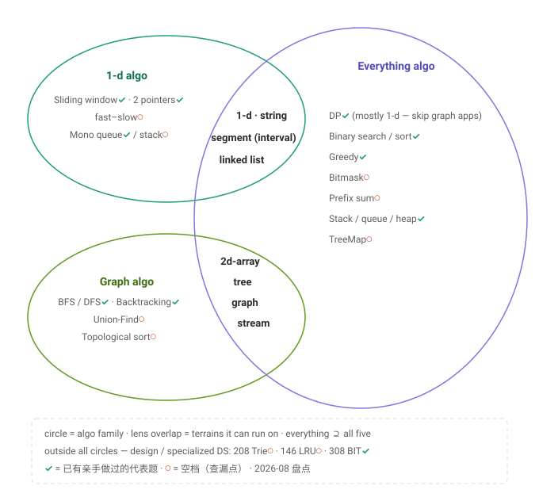
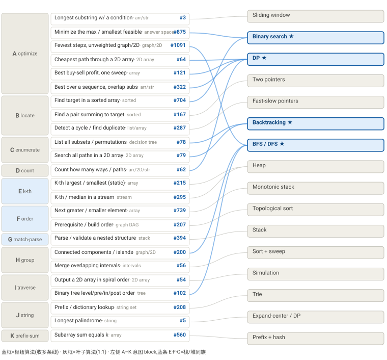

# LC Coverage Framework

两套框架：**Framework 1**（算法三圈 × 五地形，盘点/查漏用）+ **Framework 0**（题干 → 数据结构 → 算法，面试路由用）。

> **目标函数**：在面试白板前，30 秒内把陌生题从题干归到方法，对应一道代表题。
>

---

## Framework 1：算法三圈 × 五地形（Venn）

面试做题智商减一半，看到题干能认出来的第一样东西：输入是什么个数据结构。
经过一定的归纳总结，我觉得有些算法几乎只用在一维数据结构上，有些只用在图上，有些横跨两部分：
1. 用在一维数据结构（String; Array; LinkedList; Segment(Array上的一部分））上的：Sliding Window, Two Pointers, Fast/Slow Pointers, Monotone Stack/Queue
2. 用在图类数据结构 (Tree;Graph)上的：BFS/DFS; Backtracking; Union-Find; Topological Sort
3. 都能用的：DP; Binary Search; Greedy; Bit mask; Prefix Sum; Stack / Queue / Heap
4. 2-d array：2d array可以放bfs/dfs上去，也可以dp上去，所以特意把它跟图类数据结构凑到一起


| Everything algo | 1-d | 2-d | 树 | 图 | 区间 |
|---|---|---|---|---|---|
| DP | **121 · 322**（70%） | **62 · 64**（15%） | —（5%） | —（5%） | —（5%） |
| Binary search / sort | **875 · 704**（80%） | —（5%） | — | —（5%） | **56**（10%） |
| Greedy | **55**（70%） | —（5%） | —（5%） | **743** Dijkstra（5%） | **435 · 452**（15%） |
| Bit mask | **136**（80%） | —（10%） | — | —（10%） | — |
| Prefix sum | **560**（80%） | —（10%） | —（5%） | — | —（5% 差分） |
| Stack (LIFO: nesting / undo / defer) | **394**（85%） | — | 94 迭代遍历（15%） | — | — |
| Queue (FIFO: arrival order / sliding counts) | **622** · 346° · 933（95%） | — | —（102 记在 Graph 圈当 frontier） | — | — |
| Heap (priority: extremum anytime) | **215 · 295** · 703 · **23**（70%） | — | — | **743**（10%，与 greedy 行同题双料） | 253°（20%，会议室族） |
| TreeMap (total order: neighbor / rank) | **352**（60%） | — | — | — | 729 · 715°（40%，日历/区间簿） |

> 在线/stream = 1-d 的受限变体（随机访问被没收）→ sort/二分/对撞指针出局 → 只剩「边收边维护」功率谱，正好是上面四行从便宜到贵各选一档：346 队列 → 239 单调队列 → 703 定容堆 → 295/480 双堆 → 352 TreeMap。

| 1-d algo (moves) | 1-d · string | 链表 | 区间 |
|---|---|---|---|
| Sliding window | **3** | — | — |
| Two pointers (incl. expand-center) | **167 · 5** | — | — |
| Fast–slow pointers | **287**（数组当链表） | 141 / 142 | — |
| Monotonic stack / deque | **739** | — | — |

| Graph algo (moves) | 2d（图眼镜） | 树 | 图 |
|---|---|---|---|
| BFS / DFS | **1091 · 200** | **102** | — |
| Backtracking | **79** | **78**（输入 1-d，决策树自造） | — |
| Union-Find | **200** 用 UF 重做 · 305°（流式版） | — | — |
| Topological sort | — | — | **207** |

### Design（第四类）：从工业 infra 反推的练题单

思路：**大规模 infra → 常用零件 → design 题**。列从左到右越来越具体（大方向通俗 → 论文精确）；design 题的读法只有一槽——**读 ops 清单 → 推寻址组合 → 报焊接配方**（如「O(1) get + 淘汰最旧」→ 按键+按序 → hash+双链表）。（° = LC 会员题）

最右列「真题」= 2026 面经实锤（a–e 详录见表后）：a 某厂推理引擎 OA · b OpenAI 技术筛 · c OpenAI take-home · d OpenAI onsite · e CodeSignal 银行 OA。**加粗的应用 = 先看这 5 行**（真题实锤 × 出题频率）。

AI 五行按**一条请求的生命周期**排序：① 到达 → 调度准入（预算 + KV 账本双检，账本是③的）→ ② 查 radix 复用共享前缀 → ③ 未命中部分分配 KV 页、跑 prefill，此后每步 decode 长一格 → ④ token 流式吐出（客户端增量渲染），完成后回收页/引用减一 → ⑤ 加 GPU 池 + autoscale = 整机。

| 大方向 | 应用 | 关键算法/零件 | 题号 | 论文 | 真题 |
|---|---|---|---|---|---|
| AI ① | **调度准入：请求随到随插进批次（continuous batching）** | 到达/优先队列调度 · decode 优先 · 预算裁剪 | **1834**（选） | [Orca · OSDI'22](https://www.usenix.org/conference/osdi22/presentation/yu) | **a·L1** 基础调度 |
| AI ② | 前缀复用：多请求共享相同前缀，不重复算 | radix 树（压缩 Trie）+ 节点 LRU | **208** / 211 | [SGLang RadixAttention '23](https://arxiv.org/abs/2312.07104) | — |
| AI ③ | **KV 显存：显存里装下更多并发对话（KV cache 分页）** | OS 分页 + LRU 淘汰 | **146** | [vLLM · SOSP'23](https://arxiv.org/abs/2309.06180) | **a·L3a** KV-aware 准入 |
| AI ④ | 流式输出的增量 diff + 回滚（streaming differ） | 序列 diff（编辑距离/LCS 核）· 操作日志 + undo 栈 · 快照/版本 | **72**（diff 核）· 1472（回滚语义） | — | **d1** OpenAI onsite coding |
| AI ⑤ | 整机：设计 ChatGPT（GPU 池 + autoscale + 分布式协调） | ①–④ 当零件拼装 + 排队/降级 | —（拼装行） | — | **d3** OpenAI onsite design |
| 两边通吃 | **热数据快速存取与淘汰（Redis）** | LRU/LFU · 手造 hashtable · 换尾删除 · 按版本二分 | **146**/460 · **706** · **380** · **981** | — | **b1** versioned KV store |
| 两边通吃 | **定时任务：延后执行 + 挂了重试（job scheduler）** | 按触发时刻的最小堆/时间轮 · 重试退避 · lease/心跳判死 · 幂等 | **1834** · 621（形似） | — | **b2** OpenAI 技术筛 design |
| 两边通吃 | 事件可靠送达：at-least-once + 死信（webhook delivery） | 持久化队列 · 定时堆重试（指数退避）· 死信队列 DLQ · 幂等键 | **622**（队列本体） | — | **c** OpenAI take-home |
| 金融 | 行情的滑动统计（均线/极值/中位） | 队列 · 单调队列 · 双堆 · TreeMap | **346**° · **239** · **480**/**295** · **352** | — | — |
| 金融 | 生产者→消费者零锁传递（低延迟队列） | ring buffer（环形数组） | **622** | LMAX Disruptor 白皮书 '11 | — |
| 金融 | 撮合引擎：价格档 + 时间优先（order book） | 两侧 TreeMap/堆顶 + FIFO 档内队列 · skiplist | **352**/715° · **1206** · 本体手写 | — | — |
| 金融 | 历史行情/日志：狂写 + 按时间查（kdb+/LSM） | k 路归并（compaction）· 时间戳二分 · range 改查 | **23** · **981** · **308**/307 | LSM-tree · '96 | — |
| 金融 | **账务系统：账户/转账/排名/定时支付/合并** | hashmap 账本 · top-k 排序 · 时间戳惰性结算 · 合并重定向（UF 式别名） | **706** · 347 · 721（合并语义） | — | **e** CodeSignal 银行 OA |
| 先不管 | 分布式文件系统 · 向量检索 · 分片路由 | 路径树 · HNSW · 一致性哈希 | 1166°（选）· 无 LC 题 · 不考 | GFS · SOSP'03 · [HNSW '16](https://arxiv.org/abs/1603.09320) · 一致性哈希 STOC'97 | — |

#### 真题详录（2026 面经 a–e）

**a · LLM 推理引擎调度器**（某厂 OA，CodeSignal 风多级渐进）

- 题面：实现 vLLM/SGLang 类推理引擎的**请求调度器**——每个 time step 决定 GPU 服务哪些请求。不要求 LLM 背景（题面自含）；不许 AI 辅助/搜索/外部库；按过测数计分，不看 code style，正常做不完全部级。
- 概念：**prefill** = 处理整个 prompt + 出第 1 个 token，费 `prompt_len` 单位、一步内并行完成（L1）；**decode** = 之后每 token 1 单位、同请求必须逐步串行（不同请求可同一步各 decode 一个）；请求带 `max_tokens` 上限；状态机 `waiting → admitted → 完成`。
- **L1 调度规则**：① 先给所有 admitted 各安排 1 次 decode（按 `view.admitted` 顺序，最老优先）→ ② 再按到达序逐个 admit waiting 的 prefill，保证本步总功 ≤ `view.max_work` → ③ **第一个塞不下就停，不许跳过它去捡后面更小的**。
- L1 worked example：`max_work=10`，step0 到达 A(prompt 6, max 3)·B(3, 2)·C(5, 2)。step1: prefill A(6)+B(3)=9，C 要 5 塞不下 → 停；step2: decode A(1)+decode B(1)+prefill C(5)。
- **L3a KV-aware 准入**：显存池 `view.kv_capacity` 个 slot；每请求 1 slot/已 prefill 输入 token + 1 slot/已 decode 输出 token → **peak = prompt_len + max_tokens**（最后一步达峰）；准入条件 = 所有 admitted **各按 peak 计** + 候选 peak ≤ `kv_capacity`——`max_tokens` 是上界不是预测，请求可能提前结束但不可预知 → **按最坏情况预留**（保守，但保证 admitted 必能跑完）；公平性照旧：最老的塞不下就停、不跳队；内存整步占用、步后才回收；L3 不做 chunking（每个 prefill 仍一步完成）。
- L3a 例：`max_work=10, kv_capacity=6`，step0 到达 A(prompt 2, max 2 → peak 3)·B(4, 2 → 5)·C(2, 2 → 3)。
- 考点：**预算贪心 + 不跳队公平 + 悲观预留（worst-case admission）**——就是表内 146(vLLM 分页) / 1834(continuous batching) 两行的 OA 化。
- 缺的 L2 大概率 = **chunked prefill**：L3a 特意写「not handle chunking; each prefill completes in one step, *as in Level 1*」——"回到 L1 方式"反推中间那级引入过 chunking（长 prompt 切片跨步，免得独占一整步）。
- 保真度：控制流真（Orca 连续批处理 · decode 优先 · FCFS 不跳队 · token 预算）；但准入按 peak 预留是 **TGI 式保守派**——vLLM 的招牌恰恰是不按 peak 预留（分页按需分配，用满了 preempt/swap/重算）。没建模：分页块、抢占、前缀复用、批大小上限。一句话：**这题 = Orca 调度 + TGI 准入，不是 vLLM**。

**b · OpenAI 技术筛**（同天两轮，各 60 min）

- **b1 coding：versioned key-value store**——981 的版本化推广：`key → append-only (version, value) 列表`，get 按版本二分。
- **b2 design：带容错的 job scheduler**——零件：按触发时刻的最小堆（或时间轮）· 到期出队执行 · 失败重试 + 指数退避 · worker lease/心跳（超时视为死亡、任务重新派发）· 幂等（防重复执行）。

**c · OpenAI take-home**（48h 造真东西）

- **分布式 webhook 投递系统**：at-least-once 投递 · 失败重试（退避定时堆）· 重试超限进**死信队列（DLQ）** · 幂等键去重 · 持久化（重启不丢）。
- 后接 **Technical Deep Dive**：面试官读完你的项目后自己列一张问题清单，**逐行盘问每个选择**——每个 tradeoff 都要说得出为什么。

**d · OpenAI onsite**（4 轮）

- **d1 coding 1**（渐进多段：每段先跑对才开下一段，get something correct early, then iterate）：**token 级 streaming differ**——流式收 token 算增量 diff（编辑距离/LCS 核）+ 状态变更追踪 + **回滚**（操作日志/undo 栈，1472 Browser History 的回滚语义）。
- **d2 coding 2**（系统味）：状态管理 · 并发 · 内存效率；Python internals 直问：**generators / async 构件 / iterators**。
- **d3 design：设计 ChatGPT**——考察 GPU 池分配、非平稳流量下的 autoscaling、分布式协调；**model-serving 层抽象掉**（除非被要求）＝把本表 146 / 208 / 1834 三行当零件拼整机。

**e · CodeSignal 银行系统**（4 级渐进，工业实现 OA 的祖师爷）

- 规则：过全部当前级测试才开下一级；**不求最优实现，过测即可**；所有操作带 `timestamp`（字符串毫秒，唯一、严格递增）。
- **L1** 建户 / 存款 / 两账户间转账（校验存在性/余额）。
- **L2** 按**转出总额**（outgoing）给账户排名 → top-k / 排序。
- **L3** 定时支付 + 查询支付状态 → timestamp 严格递增 ⇒ 每个操作进来先**惰性结算**所有到期的 scheduled payment（不需要真实定时器）。
- **L4** 合并两账户，保留双方余额 + 交易历史 → 旧号→新号**重定向**（union-find 式别名表），历史归并。
- 考点：不是算法而是**增量重构**——每级在上一级代码上长出来，L1 数据结构选错会在 L3/L4 还债；≈ 706(hashmap) + 347(top-k) + 721(合并语义)。

**Design do-list**：`146 → 208 → 622 → 706 → 380 → 352 → 1206 → 981 → 23`（**308** 已做免修；选做 460 · 715° · 1166°）

**真题带出的新题（选）**：1472（回滚语义）· 721（合并语义）· 621（调度形似）——其余真题零件已被 do-list 覆盖。

**LC 外的债**：① 分页 / free-list——读表内 vLLM 论文比刷题值；② **order book 本体**——手写 ~100 行（两侧 TreeMap + price-time 队列）。bloom filter / 一致性哈希 / 时间轮：知道即可。


---

## Framework 0：题干 → 数据结构 → 算法（意图 block A–J）

面试真实流程：先看到**题干**，再看到**数据结构**，最后**推断算法**——没人上来就告诉你该用什么算法。这套框架按这个顺序组织：题干在最顶层（归入意图 block A–J），中间看数据结构，右边落到算法。

**怎么用**：

1. 读题干 → 归入一个意图 block（A–J）
2. 看数据结构那一列
3. 连到算法

**只有 block A（求最优）需要靠数据结构在内部岔开**；其余 block 基本「一个 block ≈ 一个算法」，看到题干就能落（见下方规律）。

**主表（按意图 block 分组，每格一道代表题）**：

### A · Optimization (max / min / longest / shortest) — the block that fans out the most across data structures
| Task | Data structure | Algorithm | Do this | Others |
|---|---|---|---|---|
| Longest/shortest contiguous subarray meeting a condition | array / string | sliding window | **3** Longest Substring Without Repeating | 76, 424 |
| Minimize the max / maximize the min / smallest feasible value | answer space | binary search on answer | **875** Koko Eating Bananas | 410, 1011, 1552 |
| Shortest path in an unweighted graph / 2D array | graph / 2D array | BFS | **1091** Shortest Path in Binary Matrix | 127 |
| Min/max path through a 2D array | 2D array | 2D DP | **64** Minimum Path Sum | 62, 931 |
| Best running profit / max subarray (one sweep) | array | scan / rolling DP | **121** Best Time to Buy and Sell Stock | 53, 122/123/188 |
| Optimum over a sequence + overlapping subproblems | array / string | DP | **322** Coin Change | 72, 300 |
| Longest palindromic substring | string | expand-around-center / DP | **5** Longest Palindromic Substring | 647, 516 |

### B · Find one / locate
| Task | Data structure | Algorithm | Do this | Others |
|---|---|---|---|---|
| Find a target in a sorted array | sorted array | binary search | **704** Binary Search | 33, 35 |
| Find a pair summing to a target (sorted) | sorted array | converging two pointers | **167** Two Sum II | 15 |
| Detect a cycle / find the duplicate | linked list / array-as-list | fast-slow pointers | **287** Find the Duplicate Number | 141, 142 |

### C · Enumerate all
| Task | Data structure | Algorithm | Do this | Others |
|---|---|---|---|---|
| All combinations / permutations / subsets / partitions | decision tree (array/tree) | backtracking | **78** Subsets | 46, 39, 131, 17 |
| Search all matching paths in a 2D array | 2D array | backtracking (+Trie) | **79** Word Search | 212 |

### D · Count
| Task | Data structure | Algorithm | Do this | Others |
|---|---|---|---|---|
| How many ways / number of paths | array / 2D array / string | counting DP | **62** Unique Paths | 518, 91 |
| Count subarrays with a sum property | array | prefix sum + hashmap | **560** Subarray Sum Equals K | 523, 974 |

### E · K-th
| Task | Data structure | Algorithm | Do this | Others |
|---|---|---|---|---|
| K-th largest/smallest (static) | array | heap / quickselect | **215** Kth Largest Element | 347 |
| K-th / median in a stream | stream | heap / two heaps | **295** Find Median from Data Stream | 703 Kth in Stream (min-heap) · 346 Moving Average (queue) · 239 Window Max (mono deque) · 480 Window Median (2 heaps) · 352 Stream Intervals (TreeMap) |

### F · Order / dependency
| Task | Data structure | Algorithm | Do this | Others |
|---|---|---|---|---|
| Next greater / smaller | array (sequence) | monotonic stack | **739** Daily Temperatures | 496, 84, 503, 42 |
| Prerequisite / build order | graph (DAG) | topological sort | **207** Course Schedule | 210, 269 |

### G · Matching / nesting / parsing
| Task | Data structure | Algorithm | Do this | Others |
|---|---|---|---|---|
| Parse / validate a nested or paired structure | stack | stack | **394** Decode String | 20, 224, 32 |

### H · Group / connectivity
| Task | Data structure | Algorithm | Do this | Others |
|---|---|---|---|---|
| Connected components / islands / provinces | graph / 2D array | flood (BFS/DFS) or union-find | **200** Number of Islands | 547, 721 |
| Merge / overlapping intervals | intervals | sort + sweep line | **56** Merge Intervals | 435, 252 |

### I · Traverse by a rule / output order
| Task | Data structure | Algorithm | Do this | Others |
|---|---|---|---|---|
| Spiral / zigzag output | 2D array | simulation (direction cursor) | **54** Spiral Matrix | 59, 885 |
| Level order / pre-in-post order | tree | BFS / DFS traversal | **102** Binary Tree Level Order | 94, 144 |

### J · Specialized DS（特化数据结构：朴素太慢 → 上为此定制的结构）
| Task | Data structure | Algorithm | Do this | Others |
|---|---|---|---|---|
| Prefix / dictionary over a string set | Trie | Trie | **208** Implement Trie | 211, 648, 212→C |
| O(1) get / put with eviction | hash + doubly-linked list | design | **146** LRU Cache | 460 |
| Range update + range / point query | Fenwick / segment tree | BIT / segment tree | **308** Range Sum Query 2D - Mutable | 307, 715 |

> union-find（DSU）也是特化 DS，但题干意图是"连通 / 分组"，已归 **H**（#200 / 547 / 721）。

### 连线图（题干×DS → 算法）

左边按 A–J 意图 block 竖排（竖条标 block 字母 + 名），每行一个「题干 · 代表题」，连到右边算法。**蓝框 = 枢纽**（多条线汇入），灰框 = 叶子（1:1）；E·F·G 三条蓝竖条 = 栈/堆同族。一眼能看出 DP / BFS·DFS / 二分 / 回溯 收了大量线。



---

## 两条规律 + do-list（Framework 0 附）

### 规律 1 — 枢纽 vs 叶子（把题干×DS 连到算法，看入度）

| | 入度 | 算法 | 读 DS 吗 | 怎么处理 |
|---|---|---|---|---|
| **枢纽** | ≥ 2 | DP（←4）· BFS/DFS（←3）· 二分（←2）· 回溯（←2） | **必须读** | 题干 → 看 DS → 才能定算法 |
| **叶子** | = 1 | 单调栈 · 拓扑 · Trie · 栈 · 滑窗 · 双指针 · 快慢 · 堆 · 排序+扫描 · 模拟 · 中心扩展 · 前缀和 | 不用读 | 扳机词 → 直接落 |

- **叶子有扳机词**：next greater→单调栈、prereq→拓扑、括号→栈、prefix→Trie，看到就落，数据结构那列都不用看。
- **枢纽要消歧**：题干流向 DP/BFS·DFS/二分/回溯 时，必须读数据结构来决定走哪条线。
- **认知预算**：80% 投在 4 个枢纽算法 × 数据结构的组合上；叶子是查表。

### 规律 2 — A 散射最多（D、E 也有少量）

block ≈ 题干意图，而**大部分意图 block 跟算法近 1:1**（B→双指针/二分、F→单调栈/拓扑、G→栈…，看到就落）。**block A（求最优）散得最开**——一个 block 内就分到 滑窗 / 二分 / BFS / DP 四种，靠数据结构区分（D 也散成 计数DP/前缀和、E 散成 静态堆/流堆，但都远不如 A）。

> 合起来：**全表最需要"读数据结构"的地方就是 block A**，那也是枢纽算法扎堆处；其余 block 看到题干基本就落。

### 旁注 — 叶子技法的横切家族（技法轴，跟 block 正交）

block 按**题干**分；底下的**技法**还能横切成几个家族，这解释了为什么有些 block 感觉相似：

- **栈/极值家族（E 堆 ↔ F 单调栈 ↔ G 普通栈）**：都是"维护一个栈/堆,把*待解决*的项压住,等未来某元素来*解决*或随时拿极值"。括号靠**精确配对**解决,next greater 靠**比较**解决——骨架同,只是 pop 条件不同。**block 已按这条把 E·F·G 排在一起。**
- **哈希记忆家族（D 的 #560 前缀和+哈希 ↔ Two Sum）**：存过去见过的状态，查当前的补集在不在。
- **游标家族（B 双指针/快慢 ↔ A 滑窗）**：序列上移动一两个游标（单 cursor = size-1 frontier）。
- **枚举/树族（C 回溯 ↔ J Trie）**：回溯 = DFS 一棵*隐式*决策树（边走边生成）；Trie = 一棵*显式*前缀树（DFS 它就枚举所有词 / 按前缀枚举）。212 = 网格回溯（归 C）+ 字典 Trie（在 J 当加速器）剪枝，两棵树一起走。
- **连续子段族（A 滑窗 #3 ↔ D 前缀和 #560 ↔ A 中心扩展回文 #5）**：都在数组/串上找**一段连续的**；问法不同（最长 / 计数 / 回文）落到不同 block，但技法同源。

这是**技法轴**，跟 block 的**题干轴正交**——两个轴的相邻要求会打架（如 G 栈在意图上属"序列专项",在技法上属"栈家族")，线性顺序只能照顾一个。这里把 E·F·G 按**技法**排到了一起。

### do-list（每个组合一道，26 道）

`3 · 875 · 1091 · 64 · `**`121`**` · 322 · 5 · 704 · 167 · 287 · 78 · 79 · 62 · 560 · 215 · 295 · 739 · 207 · 394 · `**`200`**` · 56 · `**`54`**` · 102 · 208 · 146 · 308`

> 加粗的 **54 螺旋矩阵**（block I）、**200 岛屿数量**（block H）、**121 买卖股票**（block A）是已经做过的，已归位。浏览 LeetCode 时新题往对应 block 的「其他例」列加。
>
> **▶ 下次起点**：先刷 stream 一条线 —— **295** 数据流中位数（双堆）→ 703 流中第 k 大（定容堆）→ 346 移动平均（队列）→ 239 窗口最大（单调队列）→ 480 窗口中位数（双堆）→ 352 流区间合并（TreeMap）。

---

## 刷题笔记 · 2026-06-22：Spiral Matrix I / II × Number of Islands

三道网格题，横跨 **block I（模拟）** 和 **block H（flood / BFS·DFS）**，正好演示"循环骨架什么时候能借、什么时候必须自己驱动 cursor"。

- **Spiral Matrix I (54)** — block I（模拟，方向 cursor）：单 cursor，方向是可变变量，撞墙转向
- **Spiral Matrix II (59)** — 同骨架，"读"换成"写"
- **Number of Islands (200)** — block H（分组/连通，flood）：外层扫描找种子 + 内层 BFS flood

> 约定：统一用 `(r, c)`（行、列），让 tuple 顺序和 `grid[r][c]` 同序、不翻——这是踩了 `(x,y)` vs `grid[y][x]` 交叉接线的坑后总结的习惯。

### Pseudo code

```
# ---- Spiral Matrix I (54)：读出螺旋序 ----
# block I 模拟：单 cursor，frontier 恒为 1 个，方向是可变数据
DIRS = [(0,1),(1,0),(0,-1),(-1,0)]      # 右 下 左 上，顺时针
r = c = d = 0
for _ in range(m * n):                  # 固定循环 m*n 次
    res.append(matrix[r][c]); seen[r][c] = True
    nr, nc = r + DIRS[d][0], c + DIRS[d][1]
    if 越界 or seen[nr][nc]:             # 撞墙 → 转向（方向作为数据被改写）
        d = (d + 1) % 4
        nr, nc = r + DIRS[d][0], c + DIRS[d][1]
    r, c = nr, nc                       # 前进：覆盖单 cursor

# ---- Spiral Matrix II (59)：同骨架，"读"换成"写" ----
# 唯一改动：res.append(matrix[r][c])  →  matrix[r][c] = i  （i 从 1 递增）
# 且 res 自身可当 visited（值 ≥ 1 即已访问），省掉 seen 矩阵

# ---- Number of Islands (200)：外层扫描找种子 + 内层 BFS flood ----
# block H flood：frontier 是队列（size 可 > 1），四个邻居全展开
res = 0
for r in range(m):                      # 嵌套扫描，顺序无关 → 最干净
    for c in range(n):
        if grid[r][c] == '1':           # 一块没被淹的陆地 = 一座新岛
            res += 1
            q = deque([(r, c)]); grid[r][c] = '0'
            while q:                     # BFS：把整片连通的 1 淹掉
                cr, cc = q.popleft()
                for dr, dc in DIRS:
                    nr, nc = cr + dr, cc + dc
                    if 在界内 and grid[nr][nc] == '1':
                        grid[nr][nc] = '0'; q.append((nr, nc))
```

### 三点总结：循环骨架的适用边界

1. **`for r: for c:` 嵌套双循环是二维数组的默认惯用写法，能用就用**——直接拿到 `(r,c)`，可读、不用解码。

2. **Number of Islands 用 `for _ in range(m*n)` 或嵌套循环都行，因为它与遍历顺序无关**（只要碰到每个格子找种子即可）。但 flat loop 还要 `divmod` 解码坐标，不够优雅 → **顺序无关的题首选嵌套**。

3. **Spiral Matrix 用嵌套循环很别扭**：嵌套循环把"方向"**焊死在代码结构里**（内层永远沿 c 走、外层沿 r 进，静态、均匀）。而 Spiral 要的是**可变方向**（`d` 变量 + 转向）。代码结构不能在运行时改，所以方向**必须外化成变量**，用 `while`/固定循环 + 显式 cursor `(r, c, d)` 驱动——**不能 loop 时定义一次、loop 里再改一次**。

### 两条贯穿的原理

- **单 cursor = size-1 的 frontier**：Spiral 和 Islands 是一条连续谱——同一个"扫描 + 前进"骨架，内层 frontier 从 size-1（单 cursor，`r,c = nr,nc`）涨到 size-N（队列，push 所有分支 + pop 下一个）。**BFS 就是"单 cursor 前进"在遇到分叉时的自然推广**：分叉时没走的分支得有地方存，那地方就是队列。

- **嵌套循环 = 冻结的遍历**（顺序 + 方向焊死在结构里）：问题**不挑顺序** → 借它最干净（Islands）；问题要**动态/特定遍历** → 把遍历状态（位置 + 方向 + frontier）**外化成可变 cursor + `while`**（Spiral）。能不能借现成循环骨架，取决于**遍历是焊死在结构里，还是活在变量里**。

---

## 刷题笔记 · 2026-06-22：Best-Time 全家桶（121 / 122 / 123 / 188，cost/profit 解法）

**一句话：四道题同一套骨架，区别只在「买入成本能不能被已赚利润补贴」。**

这套 `cost/profit` 解法是从单笔交易的 `min_price / max_profit` 直觉推广来的——比标准的 `hold/cash` 状态机更顺，因为它把"持有"读成一个**要 minimize 的买入成本**（而不是一个负的现金余额）。

### 四个解法

```python
# ---- 121 一次交易 ----
def maxProfit(self, prices):
    cost, profit = float('inf'), 0
    for p in prices:
        cost   = min(cost, p)             # 净成本 = 裸价（没有利润可补贴）
        profit = max(profit, p - cost)    # 卖出 = 当前价 − 最低成本
    return profit

# ---- 122 无限次 ----（只把上面 cost 那行加个 − profit；数组塌成标量）
def maxProfit(self, prices):
    cost, profit = float('inf'), 0
    for p in prices:
        cost   = min(cost, p - profit)    # 净成本 = 当前价 − 已赚利润
        profit = max(profit, p - cost)
    return profit
# 等价于贪心：sum(max(0, prices[i] - prices[i-1]) for i in range(1, n))

# ---- 123 两次交易 ----（展开成两块：第一块就是 121，第二块用 profit1 补贴）
def maxProfit(self, prices):
    cost1 = cost2 = float('inf')
    profit1 = profit2 = 0
    for p in prices:
        cost1   = min(cost1,   p)            # 第 1 笔买入：裸价
        profit1 = max(profit1, p - cost1)    # 第 1 笔卖出
        cost2   = min(cost2,   p - profit1)  # 第 2 笔买入：用第 1 笔利润补贴
        profit2 = max(profit2, p - cost2)    # 第 2 笔卖出
    return profit2

# ---- 188 k 次 ----（把 123 的两块叠成 k 层）
def maxProfit(self, k, prices):
    cost   = [float('inf')] * (k + 1)
    profit = [0] * (k + 1)
    for p in prices:
        for t in range(1, k + 1):
            cost[t]   = min(cost[t],   p - profit[t-1])  # 第 t 笔买入：前 t−1 笔利润补贴
            profit[t] = max(profit[t], p - cost[t])      # 第 t 笔卖出
    return profit[k]
```

退化链：**123 的 `cost1/profit1` 块逐字就是 121，`cost2` 用 `profit1` 补贴；188 不过是把这两块叠成 k 层。** 四道题是同一个递推，参数化 `K`：121 (K=1) → 122 (K=∞，塌标量) → 123 (K=2) → 188 (K=k)。

### 核心要点（按讨论顺序）

1. **`cost/profit` = 单笔 `min_price/max_profit` 的推广**：`cost` 取 min（最低净买入成本），`profit` 取 max（卖出后最大现金）。
2. **唯一的分界线**：1 次 `cost = min(cost, p)` → 多次 `cost = min(cost, p − profit)`。那个 **`− profit` = 把已赚利润滚进下一次买入做补贴**。1 次交易是"`profit` 恒为 0"的特例。
3. **`t` 是预算不是计数**：从第一天起并行维护所有 k 条预算车道；历史不够时高预算车道只是低预算车道的影子，够了才分岔。
4. **买入永远免费，车道差距 = 结转利润**：`cost` 能为负（利润补贴买入）；第二条车道领先第一条的量 = 第一笔赚的钱，而不是"赚了钱才买得起"。
5. **低预算是高预算的地基**：`cost[t]` 依赖 `profit[t−1]`，所以内层 `t` 必须升序、`profit[0]=0` 当边界（零笔交易的地基）。
6. **无限次 = 预算维度蒸发**：没有预算可记 → 数组塌成标量；等价于贪心"累加所有正的日间涨幅"。
7. **`cost = −hold`**：这套 cost/profit 就是标准 `hold/cash` 翻了个符号，让"持有"读成"要压低的买入成本"，对上单笔交易的 `min_price` 直觉。

### trace `[1, 2, 0, 5]`（k=2，答案 6）

```
p=1:  cost2=1            profit2=0
p=2:  cost2=1            profit2=1
p=0:  cost2=0−1=−1 ←!    profit2=1      # 净成本变负 = 第一笔利润补贴了第二次买入
p=5:  cost2=−1           profit2=5−(−1)=6
```

`cost2` 在 `p=0` 变负，正是"已赚的 1 块钱补贴了这次买入"的字面体现——这就是单笔 `min_price` 精神在多笔里的样子：还是压低买入成本，只不过成本被前面的利润压到了负数。


